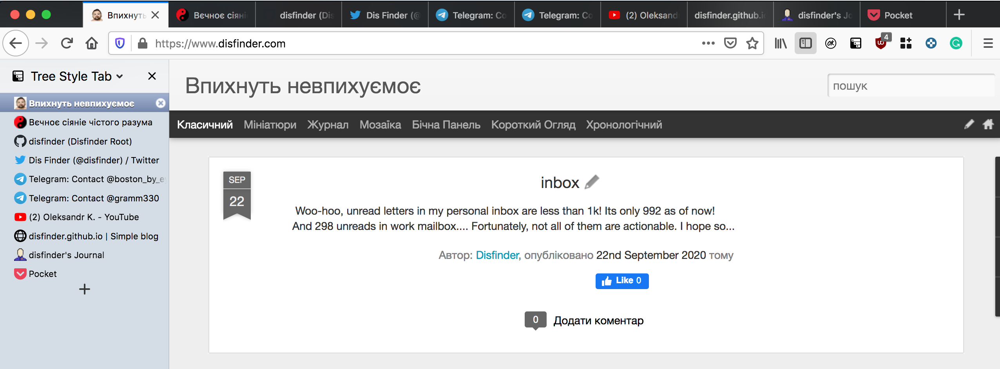
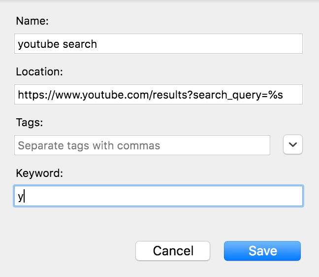

# why firefox is the best browser (2 killer-features)

Firefox is heavy, slow, monstrous.

As we know from an ancient joke on Bash.org (back when Bash was still cool [lord, I sound like an old man]):

```text
- how do you find which process is eating the most memory in Linux?
- echo firefox
```

## Introduction

With the switch to the Quantum engine things got somewhat better (though I'm not a fan of the idea of spawning a separate process for each of my >1024 tabs), so I returned with relief to my beloved Firefox. However, until yesterday there was only one reason why it was the best-of-the-best, and then suddenly I discovered another one. This is what prompted me to write this post, so here are those two reasons.

## 1. Tree Style Tab

This is a plugin that displays tabs in a sidebar as a tree. It's convenient for me for several reasons:

- on a widescreen monitor there's usually a lot of empty space on the left/right (_yes, I've been using this plugin since the days when laptop displays were (almost) square!_)
- googling something and clicking through results creates a new branch in the tree — and once the question is resolved, you can close all those tabs at once (_you could do the same by opening a new window each time, but with my habits that means more than 10 windows, which isn't very convenient_)
- a tree — or a mindmap — is a structure more compatible with how the brain works than a flat list, so it's easier to navigate
- even if you just have 10 plain tabs with no hierarchy, displayed as a flat list — the tabs look far more informative than in the traditional tab bar. and that's only ten of them!


I fell in love with this plugin ages ago, it's wonderful. And due to some quirks of Chrome's internal architecture — this kind of functionality cannot be implemented in Chrome! I tried, and there is only one plugin that attempts to replicate it — by creating a new window, meaning the tab sidebar is one window, the current tab is another, and it tries to make them work together in a clunky, broken way. Looks terrible, works even worse.

For a long time this single plugin was enough for me to put up with all of Firefox's sluggishness, memory consumption, and the fact that Chrome is now the new Internet Explorer — so countless sites work poorly in other browsers, and Google's own services — Drive, Photos, YouTube — are noticeably slower: on Radio-T they reported that Google was caught throttling and serving different pages to "their own" Chrome versus other browsers (_maybe I should try spoofing the user agent or something..._)

But the second killer feature, absent from Chrome, and the one that actually inspired this write-up, is

## 2. Custom search, or Keywords in bookmarks

Firefox out of the box can search across several search engines: type in the address bar

```text
@wikipedia foo bar
```

and instead of your default (Google) you'll get a Wikipedia search. `@ddg` gives DuckDuckGo, and as for the rest — they're all right here: [about:preferences#search](about:preferences#search)
But searching YouTube, for example — that's not there. And that's where it started — I caught myself searching YouTube quite often, felt too lazy to type the full URL, and wanted to just do

```text
y fly me to the moon
```

to listen to Sinatra.

Here's the thing: the solution to this problem is achievable via **keyword** on bookmarks! If you, like me, didn't know about this:

- any bookmark can be assigned a keyword — a shortcut that, when typed in the address bar, opens that bookmark
- the bookmark itself can be dynamic, and using the placeholder **%s**, everything you type after the keyword gets substituted into the URL!




**COMBObreaker!** No more hunting for plugins just to search in Google Maps, JIRA, or anywhere else! Create the bookmarks you need, assign them one- or two-letter shortcuts — and your navigation reaches a whole new level!

This is so great that on my work laptop I've already built up shortcuts like:

- J    - go to a Jira ticket by its full number:
      J PROJECT-123 -> https://jira.com/browse/PROJECT-123
  useful when copy-pasting a number from chat, email, etc.

- JN - same Jira, go to the main project using just the number:
       JN 123   ->  https://jira.com/browse/MYPROJECT-123
  I use this when someone dictates a ticket number or I remember/see it and type it manually

- JB - a plain static link to the Jira Board

- W - search the corporate Confluence

- T - translate a word from English using Google Translate

- TZ - open a bookmark with our team's time zones

On the personal side — YouTube and Maps search (Y and M), but I see a lot of potential here to grow.

## Conclusion

To everyone who patiently read all the way to here — I hope it was interesting or useful. If you already knew all this — great, drop a comment. And if not — well, maybe I didn't write this for nothing )

PS. Perhaps the migration from mouse-clicking to "command-line"-style operations is the first small step toward Vimperator — but I'm definitely not ready for that yet.

## Update

The [original post](http://blog.disfinder.com/2021/02/why-firefox-is-best-browser-2-killer.html) was written a couple of years ago, and now (December 2023), while porting this article from the blog into articles, I want to note that the second killer feature actually does exist in Chrome: Chrome lets you add "custom search engines" and from a usability standpoint it works the same way — you can create either a static shortcut to a page or a search with a placeholder. You can configure it here:
[chrome://settings/searchEngines](chrome://settings/searchEngines)
