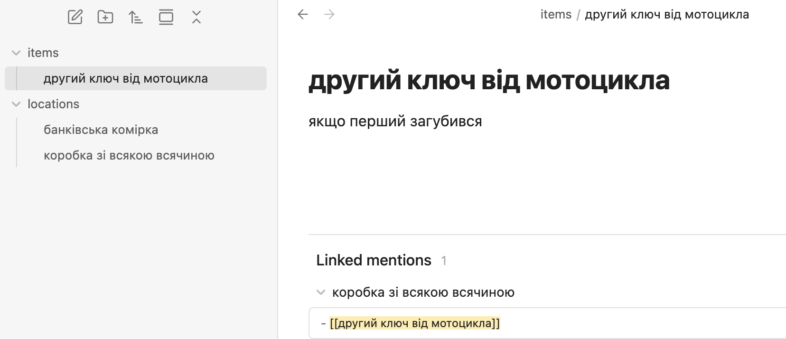
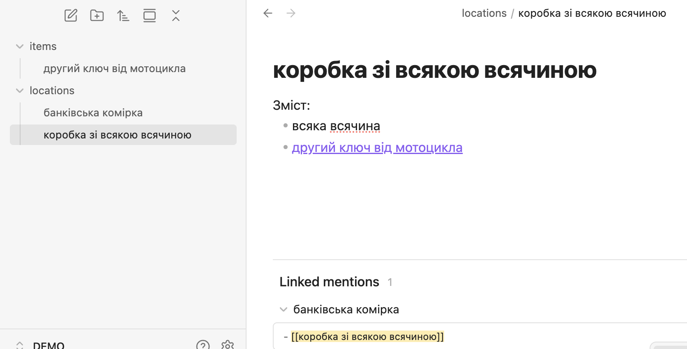
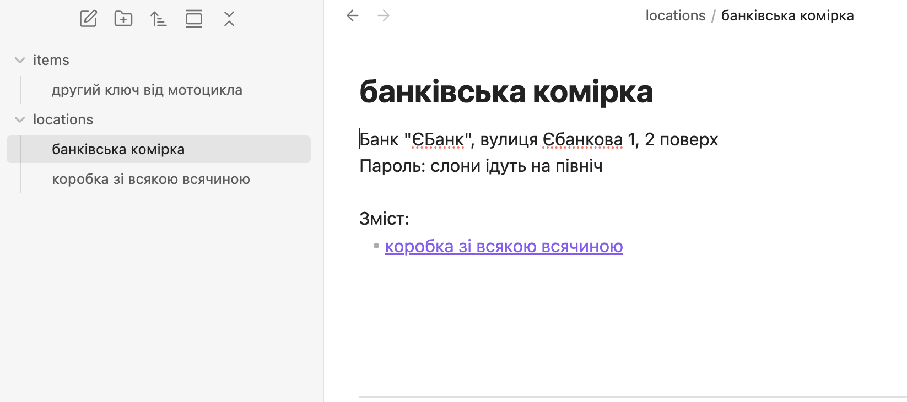
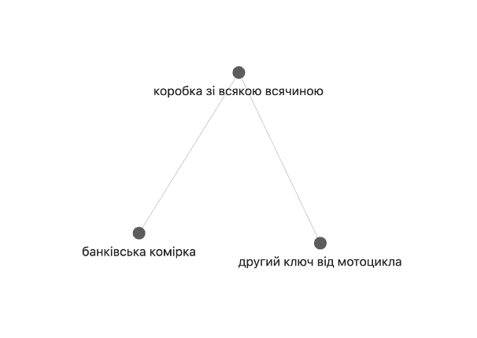
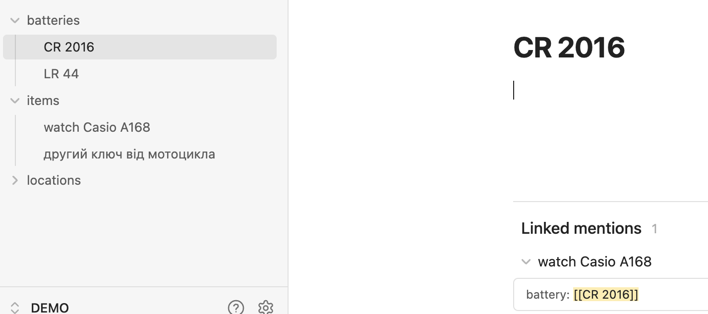
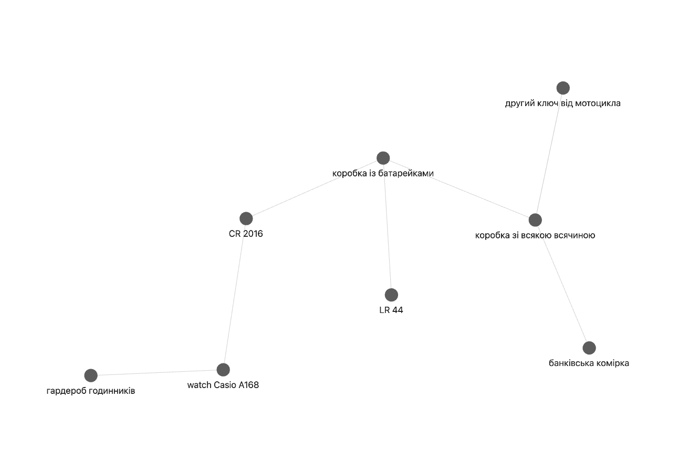
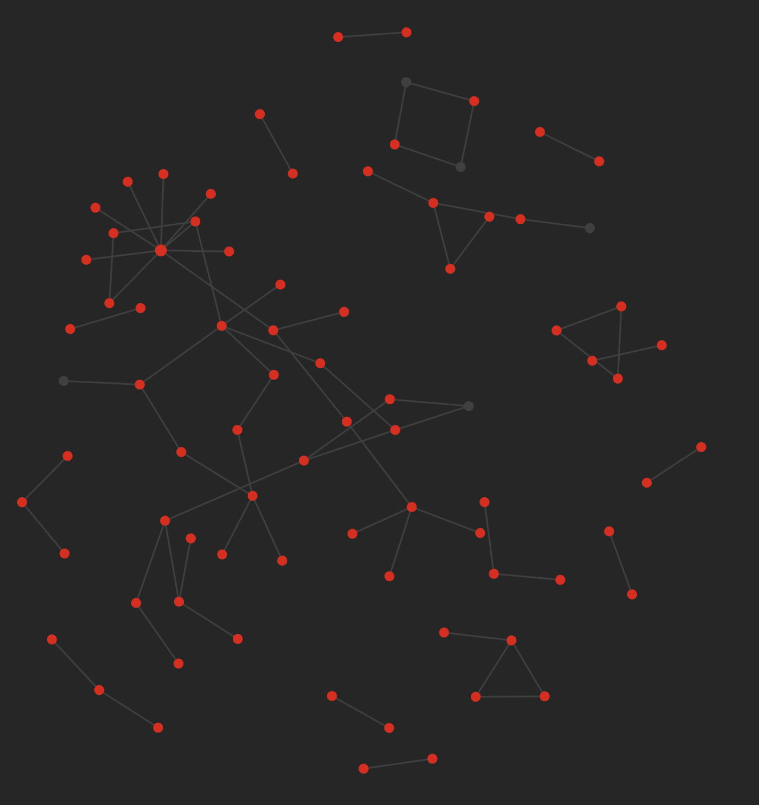

# A Catalog of Important Things (Anything, Really)

## Intro

> In library and information science, cataloging (US) or cataloguing (UK) is the process of creating metadata representing information resources, such as books, sound recordings, moving images, etc. [^wiki]

## What Problem Are We Solving


Getting an answer to the question: what is where.


There are things you don't need on a daily basis, but when you do need them — their importance becomes glaringly obvious.

For example — the spare key to a motorcycle. You don't need it until you lose the first one, but once you do need it, you really want to find it quickly and without stress, without rummaging through a hundred million boxes.

## Requirements for the Solution

A cross-platform and `unbreakeable` solution that answers the question: what is where.

By `unbreakeable` I mean that in 20-40-80 years, on a quantum 256-~~bit~~ qubit pocket computer from the "Pear" corporation, this catalog will still work — regardless of whether ["Pear" decides to drop support for 128-qubit processors](https://support.apple.com/en-us/103076) or not.

In other words, it should be an open and simple format, so that if the application for handling this format dies and stops working, you could write a Python script to export or otherwise interact with the catalog.

## Solution

[Obsidian](https://obsidian.md/)

A tool for building a `second brain` — I don't think it needs much introduction; it's a fairly popular open-source, feature-rich Markdown file editor.

In the worst case (if [Google buys and kills](https://killedbygoogle.com/) Obsidian), the Markdown with tags and metatags is easy to parse.

While Obsidian is alive and running — through links (references) and the backlinks display feature (back-references), you can easily see

- what we have described in the catalog
- and where it is located (what it belongs to, what it links to)

## How It Works

Since everything in Obsidian consists of notes, you need to create (for example) two:

- a note about the actual item
- a note about the location
- create a link in the location note pointing to the item

Place these notes in `items` and `locations` folders for convenience — since there will be more of them later — and add the links.

## Examples

### Where Is the Spare Motorcycle Key

Everything is clickable, and thanks to Obsidian you can easily see that the motorcycle key is in the miscellaneous box, which in turn is in the safe deposit box at "YeBank" bank.

Obsidian even lets you visualize this as a nice graph:

### Batteries

Not only an answer to what is where, but also what battery it requires — and the reverse question: "what does this battery fit ~~into~~"

### Example from a Real Vault

When there are a few more objects than in the demo site and the connections between them are also denser, it looks something like this:

## Conclusion and Expanding the Idea

- information catalog — what is where
- backup catalog — what gets backed up where
- physical documents catalog — passports, etc.

[^wiki]: [Cataloging (library science)](https://en.wikipedia.org/wiki/Cataloging_(library_science))
