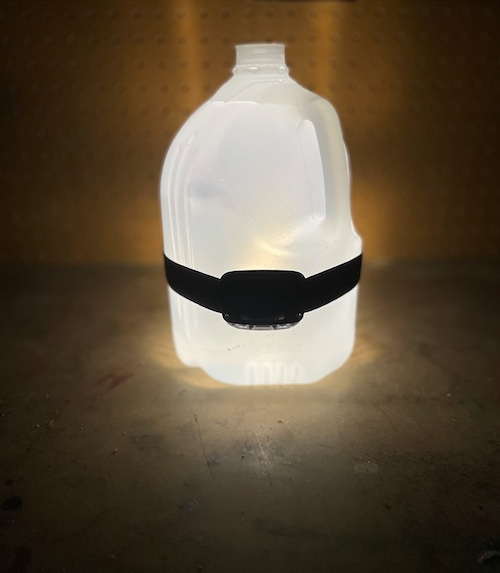
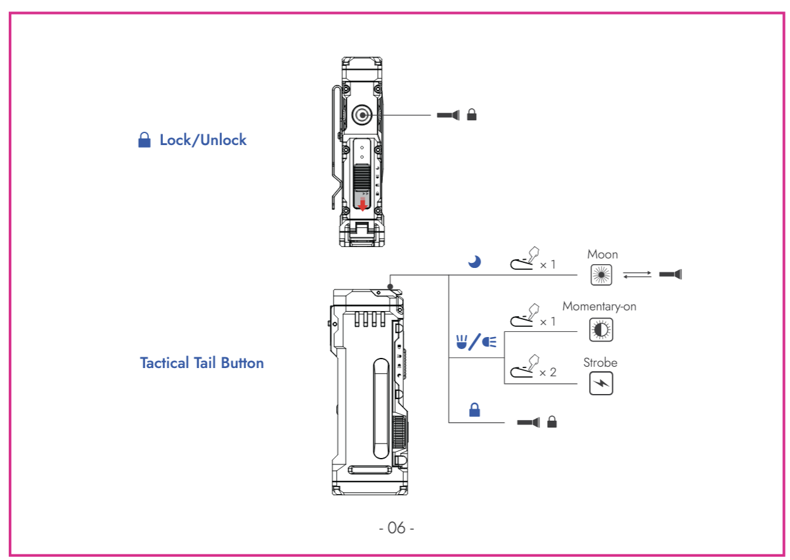

Light is an important part of life.

## Small Alonefire

|       |       |
| ----- | ----- |
| year  | 2017  |
| price | $3.28 |

AliExpress listing name: `USA EU Hot SK68 CREE XPE Q5 LED Mini Flashlight Portable Zoomable CREE Q5 led torch flashlight lamp Lighting For AA or 14500`

My goto flashlight. Small, fits in a bag pocket and in your mouth if you need both hands free. Takes an AA battery or its 3-volt equivalent `14500`. Basic functions — shine, shine dimmer, blink. Has zoom.

## Big Alonefire

|       |       |
| ----- | ----- |
| year  | 2022  |
| price | $9.88 |

AliExpress listing name: `Powerful G700 Flashlight XML T6 L2 led Aluminum Waterproof Zoom Camping Torch Tactical light AAA 18650 Rechargeable Battery`

Bought this one several times too, and the order I found wasn't even the most recent one.
Big and quite bright, at $10 with an 18650 battery and charger — but I haven't found much use for it. Fine when you need to light something up brightly, usually when retrieving something from a dark corner or from under the couch.
Wasn't very useful at camping, and it's too large to carry around.
The first one eventually lost an unequal battle with a curious child, the second is still alive, but where it is now — unclear...

## Energizer Green

|       |      |
| ----- | ---- |
| year  | ???  |
| price | ~$15 |
|       |      |

Bought for camping and turned out to be a superb headlamp:

- red light doesn't harm "night" vision — didn't know about that
- 3 AAA batteries — no charging needed
- wide headband — doesn't press on your head
- three modes: focused, wide-angle, both + red separately
- bright enough and drains batteries extremely slowly
- has brightness adjustment
- with a simple life hack turns a water bottle into a table lamp

Liked it so much that I bought another one, a red one — and it turned out to have no red LED. How does that even happen?

## Nitecore NU25 400 UL

|       |        |
| ----- | ------ |
| year  | 2023   |
| price | $36.95 |
|       |        |

Wanted a flashlight from a premium brand. Charges via USB-C, has a red LED and several light modes (two LEDs, spotlight and floodlight). Hits quite bright, but isn't adjustable. To turn on — you have to press and hold the button (annoying). IP66 water resistant. Attaches to the head with a thin elastic band that presses a bit uncomfortably.
Bottom line — more expensive and worse than the Energizer...

## Wuben X4

|       |                |
| ----- | -------------- |
| year  | 2025           |
| price | HK$ 503  ~ $64 |

Bought on Kickstarter, arrived six months after purchase.
Damn, it's $50 on Amazon now.

It's a really cool fidget. Clicks beautifully and feels so satisfying. A slider for switching between 4 modes (lock, spot, flood, moon), a power button, a brightness adjustment wheel, an additional press&hold button on the tail (lights up while held) — the whole thing makes a simply wonderful impression.

- 18650 battery, 3400 mAh
- magnetic tail
- pocket clip
- compact
- bike mount
- IP68 waterproof

{}

{}

## [Wuben C60](https://www.wubenlight.com/products/wuben-l60-zoomable-flashlights-1200-lumens)

|       |      |
| ----- | ---- |
| year  | 2025 |
| price | 0    |

Together with the X4, the good people from Kickstarter also sent an extra flashlight and the same 18650 battery at 3400 mAh.
Now it doesn't sting as much that I paid $65 for everything together.

The flashlight itself — not much to say. Very similar to the big Alonefire from AliExpress: zoom, three brightness levels, that's it. As a freebie it's fine, but at $40 — you probably don't need it.

## Sofirn IF23

|       |                                  |
| ----- | -------------------------------- |
| year  | 2025                             |
| price | ~~$55.99~~  $33.59+tax on sale   |

This thing is some kind of incredible wonder-weapon:

- claimed 4000 lumens
- 21700 battery at **5000** mAh
- IPX8 waterproof
- magnetic tail
- can act as a power bank
- a bajillion operating modes

In fact, this flashlight is the main reason this article was written at all, and everything written before it was just a small lead-up to the climax of our apotheosis.

This was the first flashlight in my life for which I needed a manual — and moreover, one I have to re-read.

It has just one button, and yet:

- main spotlight
- floodlight
- RGB light

and all of them can operate at multiple power levels, with several blinking modes (strobe, SOS, beacon).
It's a damn state machine with a ton of transitions between states!
Single click, double click, press&hold from ON, press&hold from OFF, 3 clicks, 4 (FOUR!) clicks...
Here's the usage diagram from Amazon:

And it also comes with a [manual](sofirn-if23-manual.pdf), in which the curious reader will find this entry:
> **COLOR RESET**: When the flashlight is off and on stepped ramping mode, fast six clicks on the switch to reset color mode to red
light.

> [!CAUTION]
> SIX.FUCKING.CLICKS.

Think you can handle it?

## To be continued...
