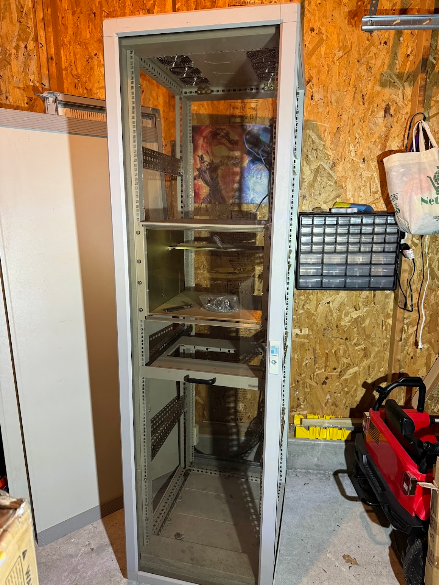
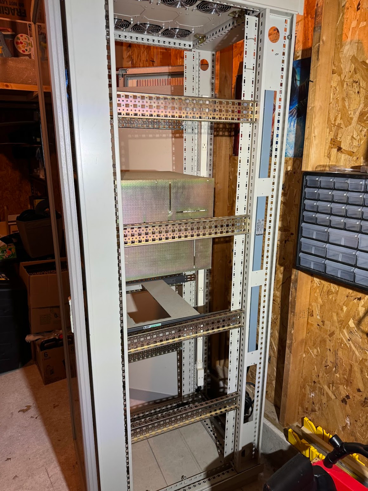
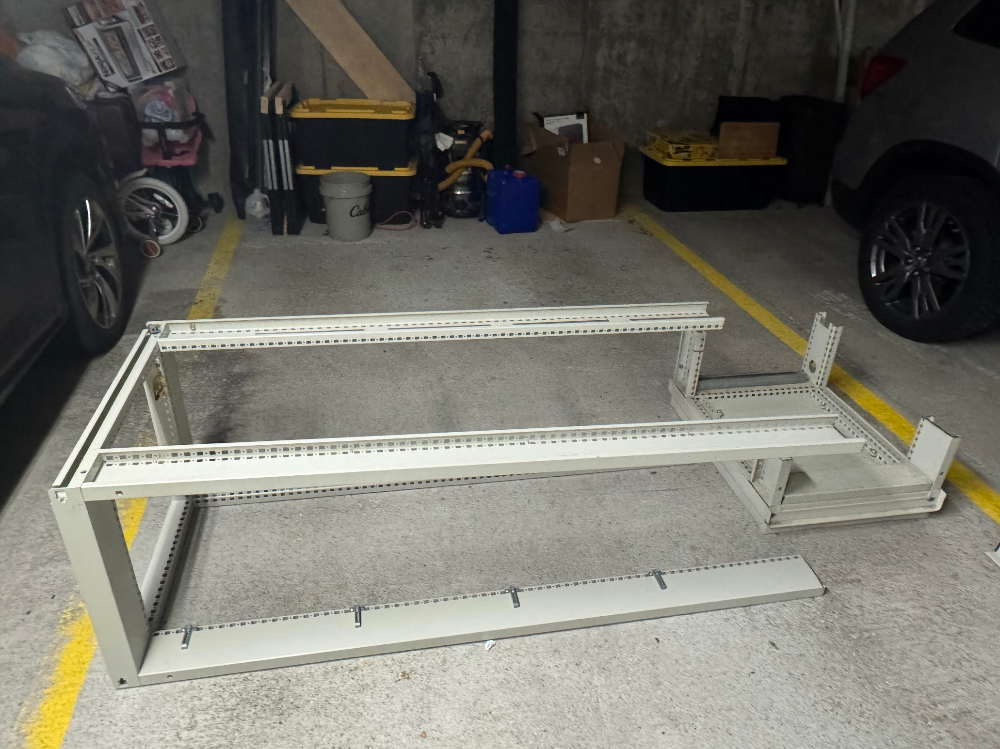
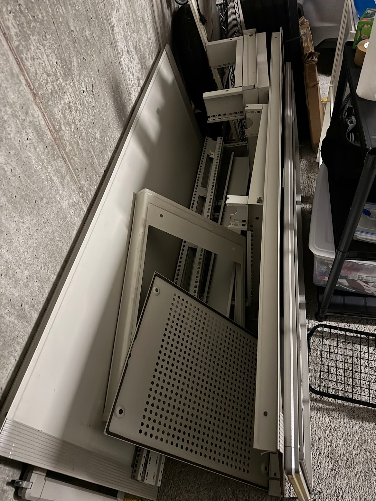
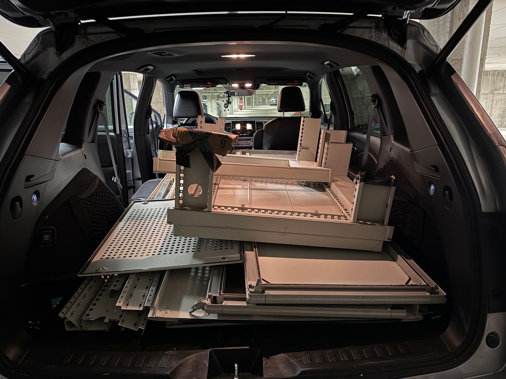

|||
| --- | ---- |
|Status|❌Cancelled|

## Have you met ~~Ted~~ Verter ?

A cabinet, not a wardrobe — because he's a boy.
<!--more-->
Since [I recently bought a server rack](/en/posts/2024/04/17/server-rack/), the next steps will be:

- wash the cabinet that had been collecting dust at a flea market for a long time
- find a suitable place for it
- buy or make shelves
- fit the 3D printers inside
- optionally fit the networking equipment inside

A couple of metal shelves that came with the cabinet are a bit too thin and too short. They won't hold the load, and won't let you use the full usable area.
Luckily, I have a sheet of thick plywood lying around in my garage — I can cut it into shelves and screw them to the chassis with corner brackets.

I also saw that there are [such inserts for racks](https://navepoint.com/navepoint-4u-rack-mount-drawer-with-lock-and-key/) for sale, which are essentially lockable compartments with a key. Might be worth buying at a reasonable price.

## How it all began

## How it all ended

