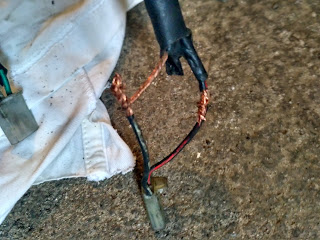
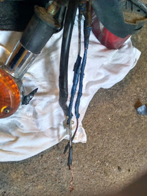
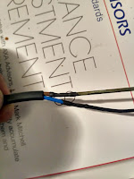
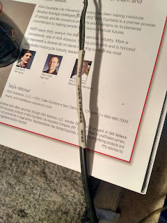
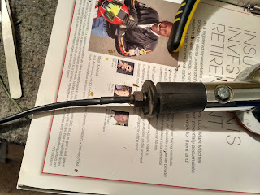
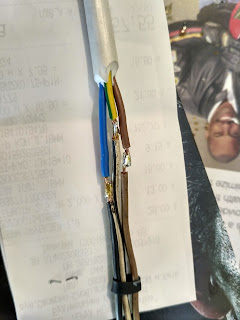
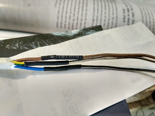
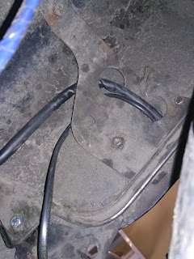
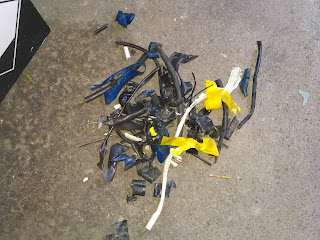
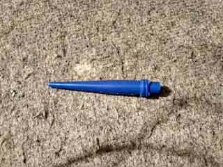

<!--more-->
## Before

## After

### Heat shrink tubing

### Replaced the wire

### Soldering on the cable to the brake light

### Heat shrink tubing again

### Neatly routed under the fender (not along the side)

### Trash left over from stripping the old wires:

### Bonus — a Smurf's willy

(actually dried silicone, half a tube wasted).

