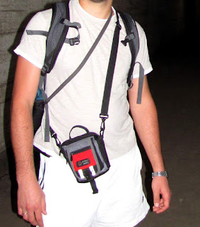
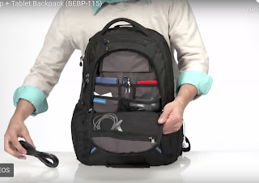

I love pockets and clothes that have them, yet for a long time I've carried nothing important in them: a phone in the front pocket gets in the way, in the back pocket it either disappears on its own or with a little help from kind strangers; leave your keys or access card in the pocket of a different jacket just once and you'll be making a trip back home.
<!--more-->

## The pouch

So for a long time I carried something that was an analogue (or a direct cousin) of a fanny pack — one that holds the bare essentials: wallet, phone, keys. Regardless of what you're wearing — a t-shirt and shorts at the beach or trousers and a jacket at the office — you have a single module containing everything you need, and as long as you have it with you when you leave the house, you know you haven't forgotten a thing.

Even though it didn't quite match a "business" suit, I had no desire to part with it even when it got worn out — three independent compartments: one for passport/phone, one for wallet, and a smaller one under the flap for keys. I've never seen that combination and compactness anywhere else.

## The backpack

For a long time my main backpack was the Terra Incognita Ventura — a standard 22-litre pack I bought for its perforated back panel, which was supposed to reduce sweating on a bicycle but did nothing of the sort. On top of that, the backpack isn't particularly suited for office use — there's no dedicated laptop compartment, and frankly the number of pockets is too few.

So I left it for rides and brutal nature hauls, and for city use I picked up whatever **Case Logic** came first. It's hard to track down the exact model now (I googled [something very similar or the same thing](https://www.caselogic.com/en-us/us/products/backpacks/case-logic-156-laptop-tablet-backpack-_-bebp_-_115_-_black) \[not the same, but looks like an improved version]), yet the blind choice turned out well — for around 600 UAH I got a laptop compartment, two more large sections, two side pockets, and two tiny micro-pockets, one of which I didn't even find straight away. There was room to carry a laptop to work and to haul 3–4 bottles of beer from the shop. Cables, flash drives, a few tools got tucked into the pockets — a sort of "Module №2", the extended kit. In the crush of a big city, for obvious reasons I didn't want to carry my wallet and phone/documents on my back, so the pouch and the backpack became long-time companions.

