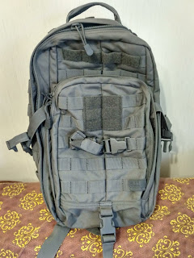
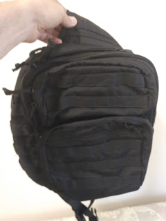
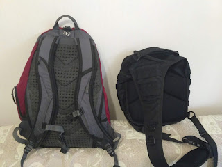
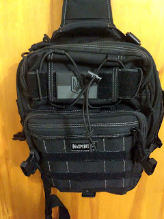
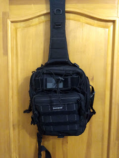

With the arrival of a motorcycle, certain changes had to be made to the everyday carry setup — or rather, to how it was organized: a small pouch might not survive a headwind, and a phone dropped even at 80 km/h would be hard to even find, let alone put back together.
<!--more-->
So I got myself an additional thigh bag — similar to the small one but with a more reliable attachment — and that again led to shuffling the wallet and phone from one place to another. On top of that, putting a two-strap backpack on over a motorcycle jacket turned out to be quite awkward.

This led me to the idea of finding/choosing a single bag that would be a single-strap, modular one. The obvious direction seemed to be tactical gear — with all their MOLLE systems and a wide range of attachable pouches.

My requirements were:

* fits a 13" laptop
* single strap so it's easy to put on and swing to the front — for public transit situations
* ability to attach/detach a small everyday pouch with phone/wallet

And so the following ended up in my hands:

## 5.11 RUSH MOAB

The [5.11 RUSH MOAB](https://www.511tactical.com/rush-moab-10.html) in STORM color — a pretty interesting bag, with several pockets on the strap and generally quite decent (though not cheap by Ukrainian standards). Real-world use revealed two non-obvious drawbacks:

1. The main and largest compartment, where the laptop goes, is too big for a laptop — it's essentially just the largest compartment in the bag. OK, inside there's a pocket that can separate the laptop from the rest of the compartment — but still, everything placed there ends up right next to the laptop, with virtually no isolation or protection.
2. The single strap digs into your neck.

It turns out that in the world of single-strap backpacks there are two approaches: in one, the strap attaches at the top in the center, allowing you to buckle it to the left or right at the bottom depending on whether you're left- or right-handed. In the second approach, the top attachment point is already offset to one side of the bag out of the box, designed for either a lefty or a righty — which makes it more comfortable to use, but less versatile.

## The Zaporizhzhia Backpack

With that in mind, my next choice was... a no-name cheap copy of a Maxpedition bag, made somewhere in Zaporizhzhia and sold through Rozetka.

Unfortunately I couldn't find better photos, but you can just barely see the asymmetry in the strap attachment at the top — in the wide section it's sewn with an offset toward the left edge, while on the right side of that same wide section there's an anatomical neck curve.

Interestingly, after I received the bag they asked me for a review — and I wrote them a direct message saying the bag was fine, but the laptop didn't fit and the design was for right-handers. Those wonderful people then asked me to return the bag, and sent me back one that had been re-sewn for a left-hander and slightly enlarged based on my measurements!

Probably the only downside of this bag was the cheapness of the materials chosen, since it cost five times less than the 5.11 or its original twin (more on that later). The fabric was quite stiff but not rigid enough to hold its shape. The pockets would flatten out and the zipper pulls were impossible to open without holding the bag with the other hand — because the zippers were stiff and the fabric offered no resistance.

On top of that, by that point the problem of finding a compatible small everyday pouch was already clear — tactical attachable pouches are made for first aid kits, extra magazines, grenades, documents — but all of them turned out to be either too large or too small, with few internal pockets, and completely unsuited for carrying on their own when detached from the bag — they had nothing but MOLLE — no handles or straps whatsoever.

## Maxpedition

Still, I decided to try the original that the Zaporizhzhia folks had copied — the [Maxpedition Malaga Gearslinger](https://www.maxpedition.com/products/malaga-gearslinger). Oh, this was a super bag!

Sturdy, excellent materials, compact — just a dream!

However — the right compatible pouch still never materialized, and it also turned out to belong to the "center-strap" camp... This wasn't as bothersome as with the 5.11 — perhaps the size of the bag itself matters, or maybe the design. The one thing that annoyed me was that some pockets had zippers with only one pull instead of two, meaning they couldn't be unzipped from whichever side was convenient. And yet the Zaporizhzhia copycats had put two pulls on every single zipper!

The decisive problem, though, was precisely the compactness — there was no room for large headphones alongside the laptop, even the power brick and mouse fit with noticeable strain, and I feel uncomfortable with an overstuffed bag. The number of pockets also turned out to be insufficient for combining my office and "just in case" needs.

So, having gone through a decent number of options (since I haven't described a few Chinese single-strap bags from AliExpress here either) — I returned to the old time-tested setup: a shoulder bag plus a two-strap Case Logic, which, though it had become quite worn over time, held everything necessary — multitool, a bit of rope, electrical tape — plus had plenty of room for a laptop, headphones, charger, mouse, notebook, a set of pens/pencils, and still left space for a bottle of beer. My wife patched it up a bit (several times, actually) and I happily carried it for another couple of years.
