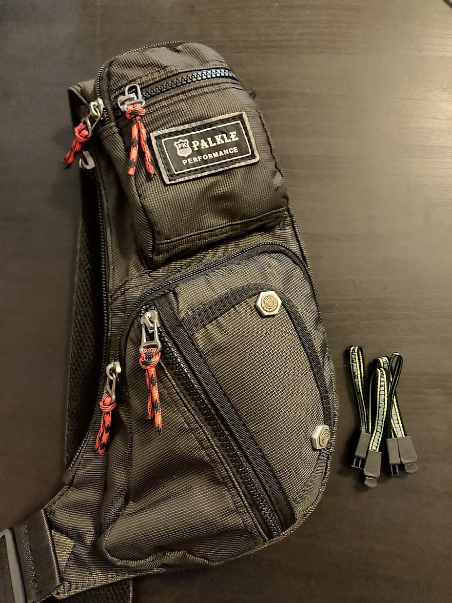

Unfortunately, nothing lasts forever — and my sincerely and long-loved CaseLogic was gradually losing ground: metal bits from my pockets had worn through the fabric, the straps had stretched out, the back panel had frayed and scuffed. The small crossbody pouch was also losing its looks, and most sadly — modern slab-phones no longer fit inside it!
<!--more-->

I tried everything. I went around with gifted (and quite decent) backpacks (no link, as they were custom-made for a company), I bought several (4) small bags on Amazon, I started wearing a vest and stuffing my phone into its pockets.

## Ogio

Then suddenly, just when I had made peace with the situation and given up my search — I got lucky twice. First, in a completely unrelated store, my eye caught the [OGIO Renegade](https://www.ogio.com/backpacks/renegade-rss-laptop-backpack/spr4704948.html), which had an even better pocket configuration than the CaseLogic — plus a few extra perks like the ability to slide over a rolling luggage handle and a hard-shell glasses pocket. I walked out of the store with the backpack, and once home I stuffed all the junk I'm used to carrying — rope, electrical tape, screwdrivers, this and that — back into its wonderful pockets.

## Sling

The second stroke of luck came when I stumbled across this [small sling bag](https://www.amazon.com/gp/product/B07GWX7PXS/ref=ppx_yo_dt_b_asin_title_o06_s02?ie=UTF8&psc=1) on Amazon: it fits perfectly:

* car keys
* motorcycle keys
* garage remote
* apartment keys + [Leatherman Style CS](https://www.leatherman.com/style-cs-24.html) as a keychain tool
* wallet
* ID documents (passport — even two) [when needed]
* vehicle documents
* earphones
* power bank + a couple of cables [when needed]
* lighter

and at the same time it is compact enough to be worn under a jacket, for example — if you put it on facing forward. In general, the ability to wear it both forward and backward is the killer feature of single-strap bags, as we remember. I only did a small upgrade to the zipper pulls, replacing them with more patriotic ones:

So the backpack mostly stays home now — that's how practical and spacious (yet simultaneously compact) this Palkle turned out to be.

Given that the car key is contactless — there's no need to take it out at all, and it sits perfectly in the small inner pocket. The house key is also contactless, but it needs to be held up to a sensor, so by placing it in the right (front lower) pocket — and with the bag worn on the front — this can be done without even using your hands.
