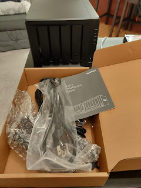
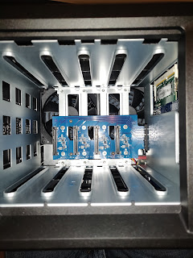
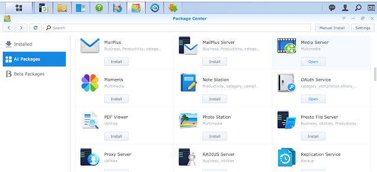

Today, among the digital residents of our home, yet another (in a long line of) little box has appeared. Actually, thanks to Black Friday (which deserves its own separate post) — several of them showed up, one after another, but this one is by far the most promising and offers the most to play around with.
<!--more-->
So, allow me to introduce — the little home NAS [Synology DS918](https://www.synology.com/en-us/products/DS918+).

I put one of the two purchased drives in it — to get some experience with expansion in the future, while nothing is configured yet and there's nothing to lose if I need to drop everything and start fresh.

Turns out, this thing has a very rich "inner world" — inside the web interface you can install a bunch of stuff just by clicking around, like a GitLab server or your own Dropbox or Google Drive.

Interestingly, none of those options lets me solve a simple task — downloading something from a remote server on a schedule via plain rsync, so armed with Ansible, I grabbed a hammer......

And only after 45 minutes of googling, trial and error, I managed to get Ansible connected to that box — because, you see, there are no home directories, then ssh key login isn't configured in sshd config, then some odd permissions get set on the home folder...

But, praise Google and [superuser.com](https://superuser.com/) — I finally got connected. Now it's time to write a playbook....

Automation, damn it — I could have done everything manually three times over by now — but you want to do it properly and elegantly..... So while in Villariба everything is configured and they're enjoying the results, in Villabajo they're implementing home DevOps best practices with tears of blood....

