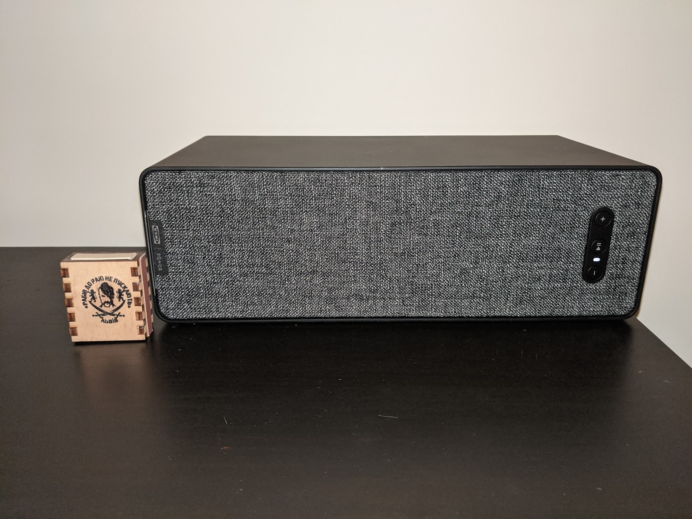

Recently my home network (which I might write about in more detail separately someday) has gained a few more residents — three or six, I still haven't figured it out myself.
<!--more-->
It all started with one Symfonisk, or rather — it all started with Bobuk. That RadioT host praised Sonos speakers (with quite a premium price tag) so sincerely and earnestly that when I spotted at IKEA, for roughly half the price, the joint product Symfonisk (a Sonos speaker in IKEA's design/branding) — I decided it was time to buy.

That must have happened back in the previous year, and the speaker turned out to be wonderful. The sound is very good for its small size, it plugs into a wall outlet, has Ethernet, but also connects via Wi-Fi in about 2 minutes (using the iOS/Android app) — though it only supports 2.4 GHz.

For today's hipsters the speaker can connect to a huge number of various online streaming services (I'm not joking, a good few dozen) — well-known ones like Spotify, Pandora, YouTube Music, Amazon Music, SoundCloud, and all sorts of others I've never heard of — like Calm Radio or TuneIn. The latter, by the way, also carries Ukrainian radio stations such as Radio Roks.

But for old-school folks like me, a pleasant surprise was that the speaker can index an SMB share (well, a network folder — we're all IT people here, after all :-) Index it and then play from it on its own, without needing anything else. That's just fantastic! I later watched a teardown on YouTube — and inside that speaker there's a 1 GHz dual-core processor and 256 MB of RAM — my first computer was worse, and my second, and possibly even my third!

With the help of my wife I found a spot for it — and joined the ranks of devoted Sonos fans, becoming an unpaid ambassador.

The design is quite understated (a matchbox for scale), but this little brick sounds very, very pleasant. At least to my non-audiophile ears — besides some Soviet-era speakers and Koss Porta Pro headphones, I haven't heard much else in my life.)
