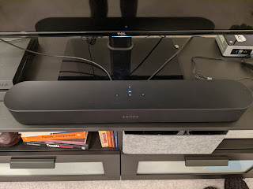
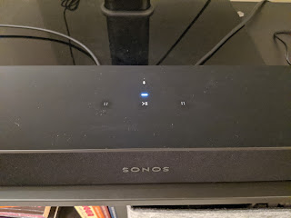

After the music in our home started sounding in a whole new way — it became very obvious just how terrible the sound from a flat TV is. Sure, there's nowhere for good sound to come from in that thing, but at least before there was nothing to compare it to.
<!--more-->
So I started looking around — didn't take long — and went straight for the **Sonos Beam** soundbar. The choice was easy: I specifically wanted Sonos for the integration with the existing Symfonisk, but as I mentioned before, Sonos pricing is premium — so I had no choice but to go with the cheapest option. And even then I waited for the Black Friday sale to save at least a little bit more.

With the soundbar, the TV lit up with new colors and rang with new sounds. Setup is just as simple — the app on the phone says "I see a speaker here, go ahead and press the button on it" — you press it to confirm the speaker is yours, it does some internal magic and boom — now there are two speakers, and all those hundred million streaming services and the offline music library can play through both of them. Over the air.

It connects to the TV via an HDMI cable into a special port with ARC (Audio Return Channel) — meaning all the sound that comes into the TV, whether from the TV itself or from another HDMI input, gets routed to the soundbar, and volume is controlled on the TV. Beautiful!

What's more, the TV sound can also play through the other speaker in the system — depending on how you configure it.

But that actually sounds unpleasant — when the same movie is coming from both the soundbar and from the left speaker. So for films — soundbar only; for music — both.

This one is already a product without IKEA, but also a more serious one — it has built-in microphones, so besides speaking it can also listen via Google Assistant or Amazon Alexa. It has a touch panel on top (well, more of a touch zone) — volume, pause, skip. The panel (and the microphone) can be turned off, thankfully, because it reacts not only to human fingers but also to cat paws.

This pre-New Year's Christmas gift triggered yet another purchase — the TV's stock legs were too short, shorter than the soundbar, and the soundbar was blocking the infrared receiver for the remote. And placing it behind the TV just did not sit well with my sense of aesthetics — and not only because I wanted to show off to guests (who never come anyway) what a fancy speaker I'm paying off on credit, but also because I wanted to use the touch panel — back then there was no cat yet — and also just because it looked bad. So I bought a center stand for about half the price of the TV, with adjustable height, to lift the TV above the soundbar. The things people will sacrifice for the sake of music...
