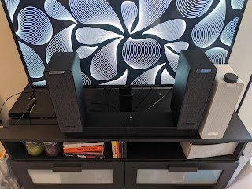
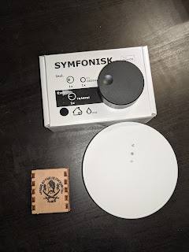

So, the TV problem (and the set-top box audio along with it) was solved at the cost of blood and nerves in a battle against greed successfully. It seemed everything was great, but the infection had already taken deep root in the organism — you step into the kitchen and can't hear the TV, and lying in the bath under a stream of your favourite podcast would be nice too, and besides, I noticed IKEA also sells wireless remote controls for sound…
<!--more-->
And then quarantine conveniently arrived, and we had to place a small order from IKEA. A family council, exhausted by my months of whining, finally gave the green light, and the order price increased sevenfold threefold.

Unfortunately, I didn't have the energy or money for all my wishes, so I had to settle for the minimum set — one more Symfonisk for the living room/kitchen for stereo, one more — the white one — for the bedroom to listen to whatever comes along (and they can also act as an alarm clock and play whatever you schedule — radio, music, a podcast, or beeping), and of course the wireless remote control, damn it — because it's not always convenient to run to the speaker or poke at your phone, especially when you're hungrily devouring artfully frying something in the kitchen.

So, the soundbar has acquired two satellites. Of course, they won't be sitting here but will hang on either side of the sofa — and that's the huge advantage of wireless speakers — no constraints, as long as you can reach a power outlet. Dolby surround!

The white one will be a shelf speaker in the bedroom — an alarm clock, and there turned out to be an unexpected bonus: it plays beautifully onto the balcony through an open window.

And the round puck on the white speaker — that's the wireless dial remote. It can control any speaker (or group of them) — volume, and a click for pause, double/triple-click for previous/next track. As a bonus it's also magnetic on the back (and a matching metal plate and double-sided tape are included in the box), so the first one went straight onto the fridge.

The only fly in the ointment of this tape barrel — these dials don't work with the speakers directly. Well, technically they do, but for that you need to buy an IKEA smart home hub, set it up, and then connect the dials to the speakers through it. So it's apparently some kind of external solution where the hub receives signals from the remotes and proxies them to the speakers — but damn, besides the money it also cost me a router port and I had to find power for that hub somewhere.

The round white thing is the hub, and you also need to install a special IKEA app to configure it. This whole setup is for a smart home in general, so it also controls light bulbs and blinds, but today I only need the sound (although automatically opening the blinds together with the alarm clock would be wonderful). Fortunately, the router happened to have exactly one free port left (God, and I have almost everything wireless…), and that same router — thanks to its USB port — also became the power supply for the hub: it needs 5V, and a cable and adapter are included, but I simply have no room in my outlets (and power strips) — an extremely unfortunate configuration in that room, doing what I can.

And those little dials are also connected to the hub with some simple manipulations following the app's instructions, and then in the app — to the desired speaker. It works!

I just couldn't figure out how they connect — the package includes a CR2030 battery, and I doubt it would last through WiFi for the advertised year or two, so I think it's either Bluetooth or some smart-home alternative. I got three dials — one for the bedroom, and two to control the system from both the kitchen and the sofa. Either way, the number of IP addresses on the network grew by 2 speakers + hub, and the total device count — by 6. Plans (possibly very distant) include setting up monitoring for everything that has an IP, and pulling traffic stats from the router to see how much internal bandwidth all these speakers, phones, and laptops are consuming — curious whether all of this loads the WiFi capacity and whether it's time for some kind of upgrade.

An upgrade — because now for all these speakers we obviously need a **subwoofer**….
