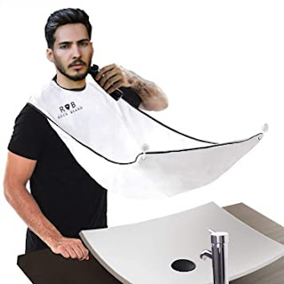

About 4-5 years ago I bought this wonderful little apron on AliExpress for gentlemen who prefer to take care of their beard themselves:
<!--more-->

A cheap thing — a piece of smooth synthetic fabric with a velcro strap around the neck and two suction-cup hooks for the mirror — made trimming my beard even easier, since you no longer have to fish hair out of the sink or wherever you used to scatter it before.

Today, with barbershops closed and gentlemen switching to self-sufficiency — add this kind of accessory to your trimmer, you won't regret it. Unfortunately, the link to the one I bought has gone dead (and my version has rather unreliable suction cups — one keeps falling off), but these things are easy to find on AliExpress by searching for "man trimming apron".
