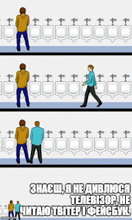

Re-reading my own blog and going through the sparse comments, I noticed that one of my friends' domains — [tsybulko.org](http://www.tsybulko.org/) — has gone dark. A shame.
<!--more-->

I do know for sure that my friend is doing fine — he switched to Facebook, which is increasingly killing off standalone blogs. I, on the other hand, having noticed how my Facebook usage pattern had shifted toward consuming useless junk, decided to add a social quarantine on top of the physical social distancing already in place. Facebook was already the only social network in my life — LinkedIn and Twitter can hardly be called social networks for me: I visited the former maybe once a month, and on Twitter I have no social component whatsoever — I don't know a single person there personally.

Two weeks ago the first phase of the experiment ended — I checked in on Facebook after a month-long quarantine, was satisfied with the results, and returned to continuing it.

12 visits to Facebook per year — isn't that a worthy goal? After all, even the blog has perked up a bit, not to mention the time freed up for other interesting and useful activities. I hope it only gets better from here.

