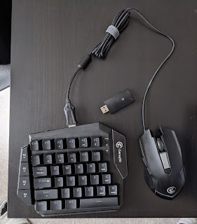
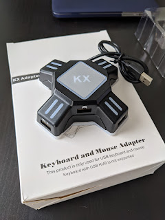

Some time ago my "dear friends" talked me into buying a **console**, a.k.a. PlayStation 4. The main argument in favor was the release of Borderlands 3, which my existing hardware couldn't handle at all. Weighing the pros and cons — namely, $800 for a gaming PC versus $100 for a gaming console (used) — I chose the latter, drove a good hundred kilometers to pick it up, and got the console itself, a couple of controllers (originally one), a charging station for the controllers, and a **Mortal Kombat XL** disc!!
<!--more-->
However, an unpleasant surprise was that unlike button-mashing in Mortal Kombat, playing first-person shooters with controllers isn't as comfortable or familiar. Friends assured me it was just a matter of habit and would pass quickly and that I'd get used to it, but I still suffered without a mouse.

The console didn't recognize the wireless Logitech set, nor the wired mouse either. Well, technically the console did see it and you could navigate its menus with the keyboard, but in games — nothing doing.

But I had no intention of giving up — because I wanted to enjoy myself, not "step outside my comfort zone" — so googling revealed there was a hardware solution. Specifically, you buy a controller that connects to the joystick on one side and to the mouse/keyboard on the other, and translates the movements of the PC peripherals the user is used to — mouse and keyboard — to the console as if they were coming from the joystick.

The one recommended by the best connoisseurs was the [XIM APEX for $125](https://www.amazon.com/XIM-APEX-Keyboard-Mouse-Adapter/dp/B079SS1CCR), as the least buggy solution. The price seemed too high to me (even though I understood I had saved on the console and was psychologically prepared). After searching on Amazon, I picked two others with the idea of trying both and returning one.

The [first kit](https://www.amazon.com/gp/product/B07N2SSWHV) included its own mouse and a half-keyboard. So at $100 it looked more attractive than the competitor.

The [second one](https://www.amazon.com/gp/product/B07ZHLF5L6) — just a controller for $20.

As it turned out, the first one proved to be quite decent, though not perfect — there are occasional lags and glitches. But I blame that on the console, since glitches also happen with USB-connected headphones.

And most importantly, the keyboard and mouse are wireless, so you don't have to be tethered to the console by a cable — you can sit wherever it's comfortable and aim at enemies the way you're used to.

Controllers for Mortal Kombat fans, mice for FPS players!
