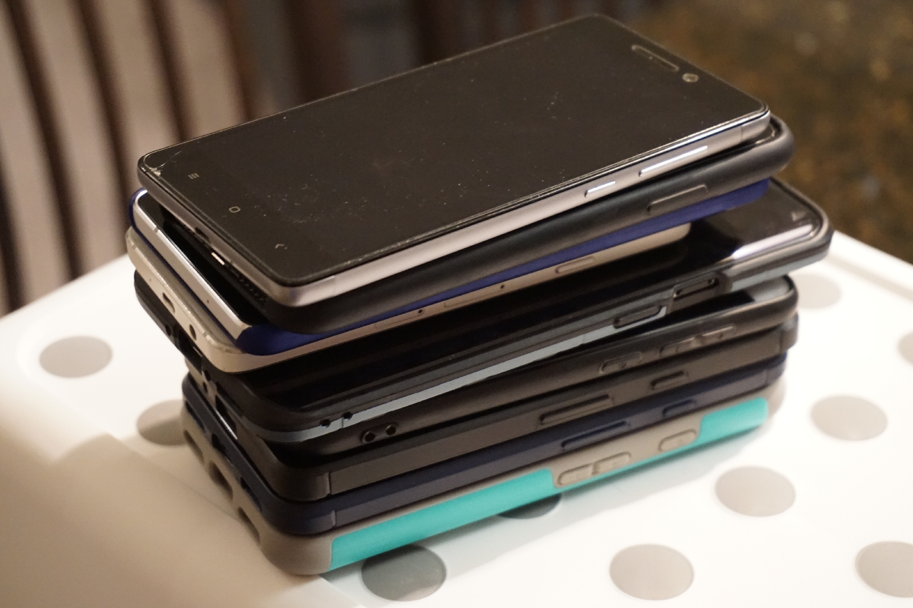
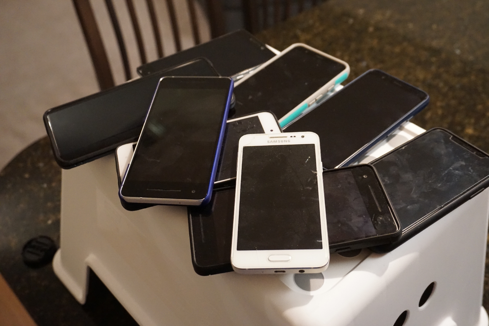

Even when you only need a single SIM card, somehow there are too many phones in the house...
<!--more-->

One with a home SIM (to make it easier to travel back home, old contacts, lots of things registered to domestic numbers), one with a local SIM, one work iPhone that was forced on me — and where the other two came from is anyone's guess...
