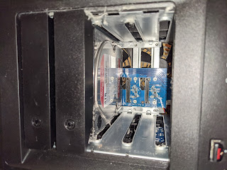
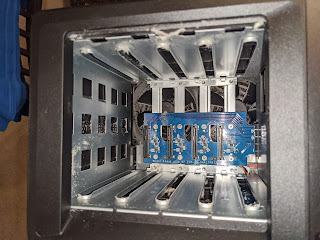
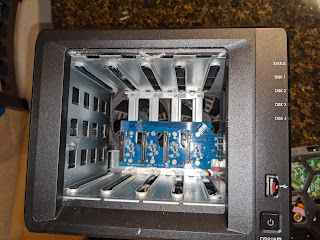
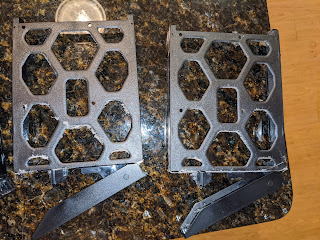
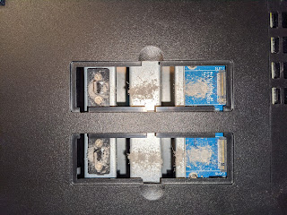

Got out of the habit of tower computers with big fans...
Only half a year has passed since that memorable Black Friday when a Synology moved in with me — and this is what its (her?) insides look like today.
<!--more-->

