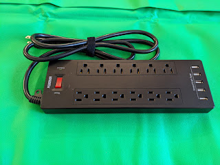
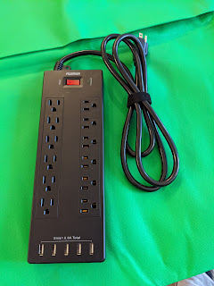
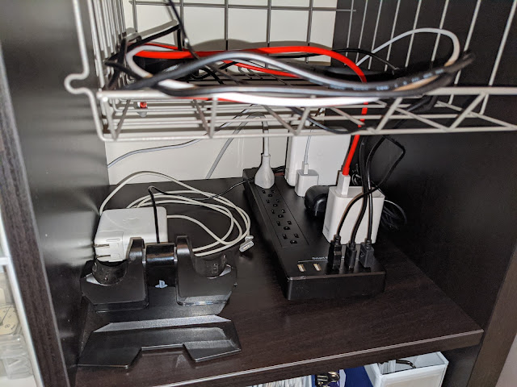

Several little gadgets arrived today — groceries and toilet paper get logistics priority over hardware, so the wait was long. But this thing with 12 outlets + 5 USB ports should significantly reduce the entropy of my little cabinet. Life in the 21st century demands constant charging, and not just physical exercise to keep the belly in check, but electrical charging too.  <!--more-->
Woke up, charged the phone, charged the watch, charged the power bank, charged the laptop, charged the work laptop, charged the fitness tracker, charged the wife's power bank, charged the headphones, charged the game controllers, charged the mouse..... What did I forget? Oh, charge the work phone! Damn, and the first phone is already dead!
Jokes aside, you really do need a lot of outlets, and mostly to plug in USB things, so voilà:

I didn't think to take a "before" photo, and the result isn't final yet — another gadget is still on its way. But it looks like this monster can handle everything listed above, plus electric toothbrush chargers, camera batteries, drone batteries, the watch..... I feel like I'm still forgetting something....

In the photo — one cube of the IKEA KALLAX shelf with a matching basket. Chargers on the bottom, devices in the basket. Beautiful, ventilated, convenient.
