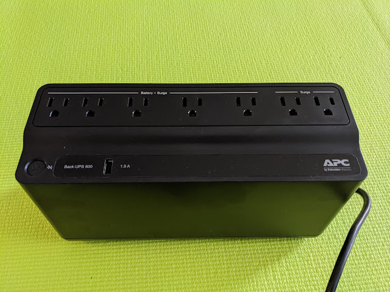
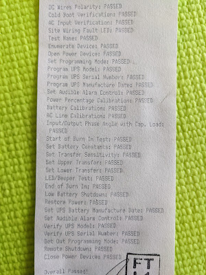
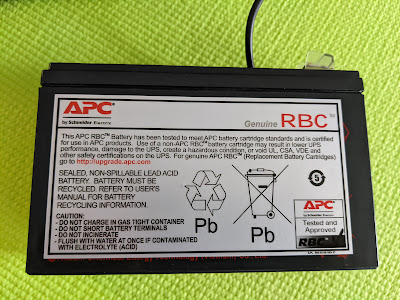
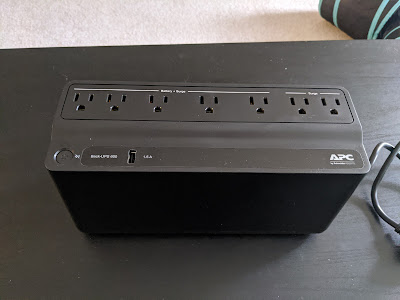

Well, look who's here! My first UPS! Having lived on laptops for over a decade, I never felt the need for one — if the power goes out in the building, the ISP's equipment will most likely go down too, and if it's just a blown fuse, the router will reboot in a few minutes, no big deal.

<!--more-->
But now that I'm dealing with hard drives and a Synology NAS — which of course has no built-in battery — I bought one after the very first flicker of lights. The wind was strong, and knowing how fond they are of running cables through trees around here, I decided not to wait for the next gust.

It was nice to see the test results report, thoughtfully taped to the UPS case with masking tape.

The battery is small, but it's enough to properly shut down the NAS, and the router, if needed, doesn't eat much power. The box claims that a modem+router pair can run off this unit for 4.6 hours. Well, APC units have worked reliably in my experience. We'll see over time.

PS: black equipment goes great with black furniture, but photographs terribly )))

