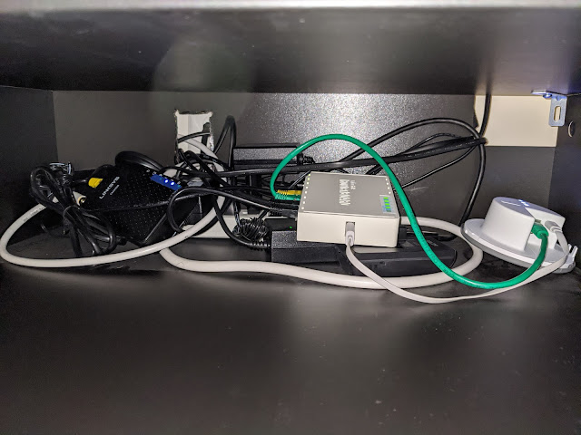
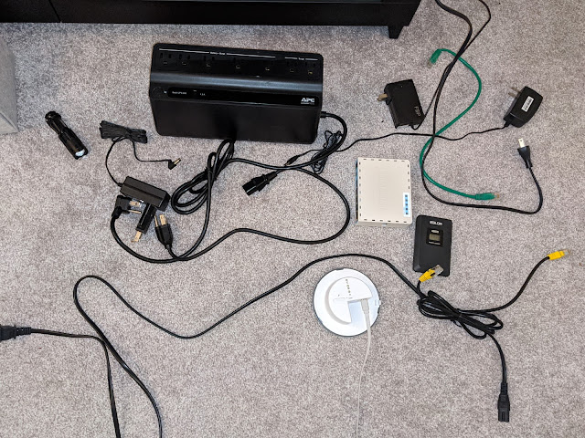
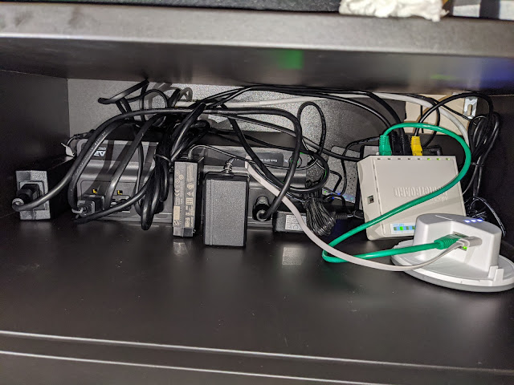

I'm obviously not going to connect just one NAS to the UPS — that would be both unfair and unwise.
<!--more-->
So I'll have to stuff it (the UPS) into the nerve center of my digitalization setup — specifically, into a small shelf in the under-TV cabinet where everything lives: the cable modem, the router, the IKEA router for their smart home, the power brick for the Synology (a hefty one), the power brick for the Intel NUC, and a tangle of cables between them. This whole operation is sealed off from the cat so he doesn't crawl in for the warmth, and as a result, with no adequate ventilation it gets even hotter in there — so there's also a wireless temperature/humidity sensor sitting in there, which I only care about for the temperature reading (32°C on average). Incidentally, today's setup is only possible thanks to the failure of a previous project to move the Synology into a closet (couldn't find the right cable for the socket) — had I spread the server and other junk across different rooms, one UPS wouldn't have been enough.

Deep in the clutter you can see a white 6-outlet power strip; the UPS has seven ports plus a USB port, which is very handy — right now the IKEA hub is powered from a MikroTik port, and thank God that port exists on the MikroTik, because there's simply nowhere left to plug in another power brick. Whoever wired this room was extremely stingy: right where the TV cable comes out — where any normal person would put at least two double outlets — they put just one. The TV, the power strip — and that's it. But now things are about to get better!

## Before

I pulled out less than half of everything just to give a sense of the scale of the disaster

## After

After the reconfiguration, the sensor readings climbed to 37°C... True, I placed it right between the hottest guys — the Linksys modem runs scorching hot! I'll watch it for a couple of days and hope the temperature doesn't keep rising, because I really don't want to tear apart a relatively successful implementation, and improving ventilation is quite tricky — unless I rig up something forced. A USB port on the MikroTik did free up after all! :-)
