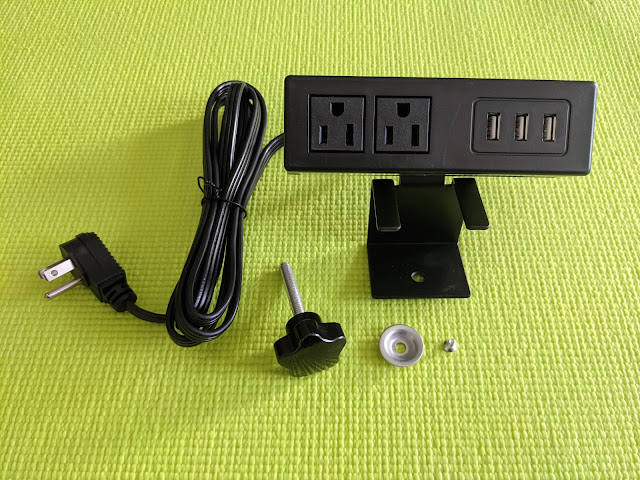
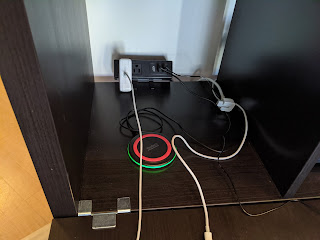
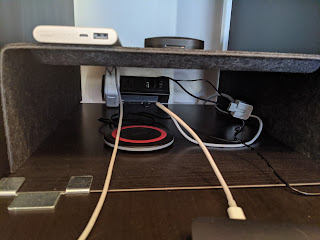
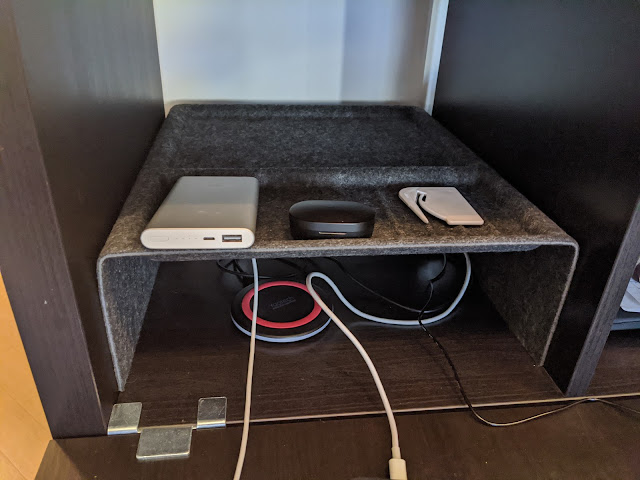

As expected, 12 outlets turned out to be not enough (or rather, not everything can be plugged in at a single spot — sometimes the cable is just a bit too short), so the final (for now) addition arrived to catch up: a wall-mounted outlet block. They come in various configurations; I went with a more compact one that maximizes USB ports.

<!--more-->

I needed to connect two devices — a laptop power supply and a desk lamp — and I was quite surprised when the lamp arrived with a USB connector instead of a regular plug. Maybe an adapter was included, but if it works without one, all the better! And all that cabling had to be hidden out of sight — for aesthetics, and to keep it away from the cat. So we mount it out of the way, between the cabinet and the wall, at desk level.

In the final version, nothing hints at the hidden device, and there's still room for a couple more connections. Beautiful!

