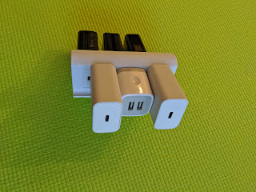
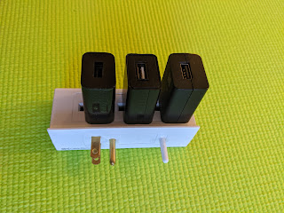
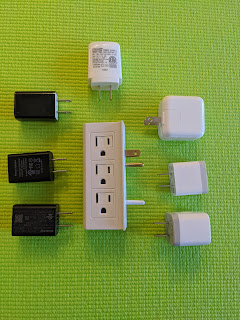
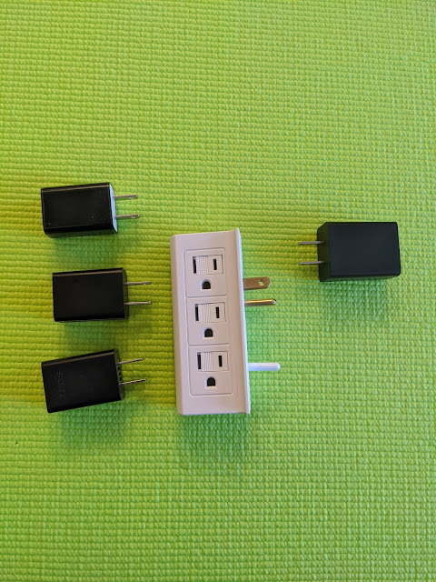

And to answer the question, "why bother with [all that fuss](/en/posts/2020/05/09) with [extension cords](/en/posts/2020/05/12)" — the answer is: to get rid of (or rather prevent) constructions like these:
<!--more-->

And the classic — one blonde among all the black ones. Unfortunately, six weren't to be found, so I had to make do with four.

Just occurred to me — what's going to happen when the kids come along?...
