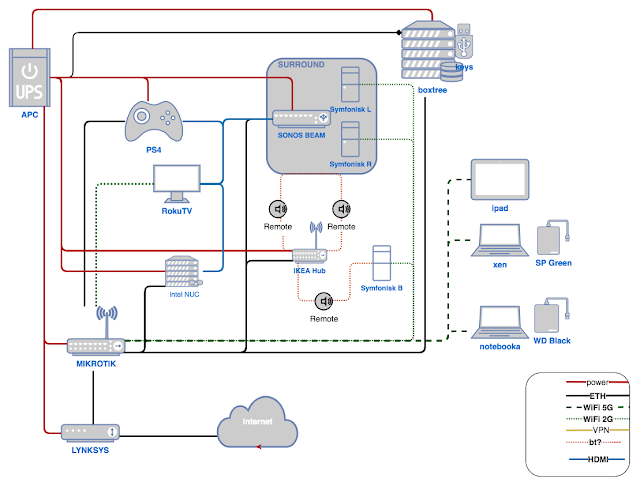

Working from home has shown that Wi-Fi can sometimes be unstable — it's still unclear whether it's the microwave oven or something else. So I'm going to try connecting the laptop the good old way, with a cable. The one catch is that my router only has 5 Ethernet ports, and all 5 are currently occupied. I decided to tackle the problem systematically — first draw out what's connected where, then figure out where to plug what, whether to get a PoE switch or a plain one, whether to save money and go with Fast Ethernet or go for Gigabit after all... The price range runs from $10 for the simplest 100 Mbit switch to $60 for a Gigabit one with PoE. While the deliberation is still ongoing — here's what a simple home network diagram looks like. Of course, there are still a few components missing from it; I'll keep adding them little by little....

