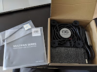
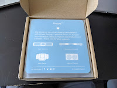
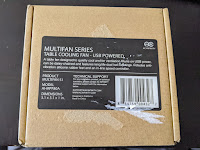
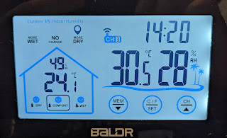

The joke about [forced ventilation](/posts/2020/05/11) has come true — it's not even peak summer yet, and the equipment shelf is already showing +38ºC.

So a quick Amazon search turned up the smallest (80mm) decent consumer fan I could find — USB-powered, a 3-speed gearbox, and advertised as quiet.

The result: 30ºC on the first gear. Ready for summer!

