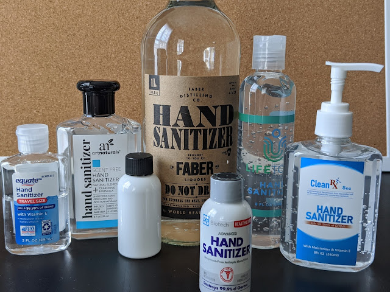
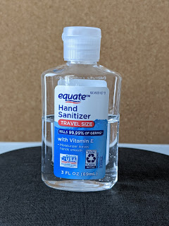
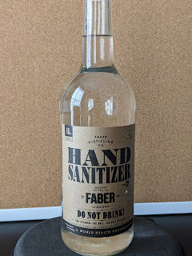
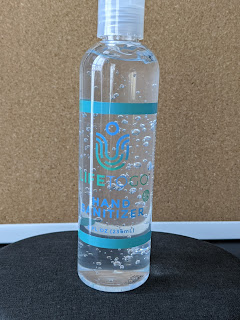
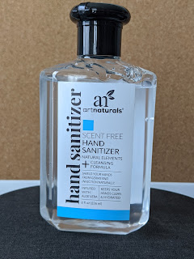
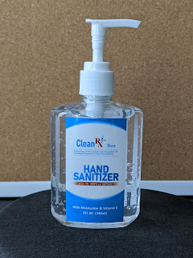
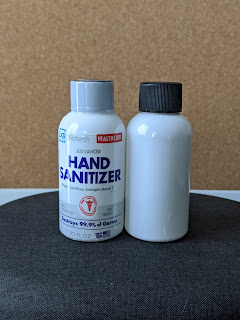

Today at the store I saw a whole variety of hand sanitizers — looks like the panic is over, and some production capacity has been created or retooled.
<!--more-->

This little bottle had been rolling around in the car since the long-forgotten pre-pandemic times, just in case I'd need to use a public restroom or something. When the panic-buying swept everything off the shelves, it (along with a couple of bottles of rubbing alcohol bought mostly for cleaning purposes — like removing adhesive residue left by price stickers) — was the only means of disinfection outside of soap's reach for a long time.

The first find was this product from local "moonshiners" — friends tipped me off which store sells 80(!) percent alcohol diluted with glycerin and some other stuff. $10 per liter, pretty decent, although unfortunately it doesn't work for my chemical needs. But it does burn. And it's liquid — less convenient for hands compared to thicker alternatives.

"Made in USA" — proudly printed on this little bottle. Bubbles add appeal and freshness! (freshness of a hand sanitizer, Carl! what are you on about...) And it has the highest concentration of the portable ones — 70%.

Also not bad, thick — but already made in China and 63%.

The bottle with a pump dispenser went into the car door pocket — convenient, compact, accessible.

And the biggest disappointment of all purchases — plain bottles with a screw cap, liquid 63% alcohol inside. No dispenser, no thickness, and to open it you have to peel off a film, after which the little bottle is left without any identifying markings. Don't buy, garbage. The most compact, yet absolutely useless.

