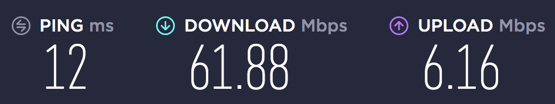

For this right here — $40 a month for 12 months. After a year it'll be $60/month.
 Cobblers without shoes....
<!--more-->

A separate, long and sad story: how I spent nearly a week trying to get this internet connected, hanging in chat for hours at a time, then — when the chat broke — on Facebook, then 40 minutes on the phone and back on Facebook again. But I got it connected in the end, saving $60 on a "specialist" visit....

----

Found this post from two years ago in my drafts, and the image that was supposed to be there has already been lost, unfortunately. It was something like 15 or 20 Mbps though. Since then both the ISP and the place have changed, only the hardware stayed the same. At the new place I decided not to waste my time and nerves (and frankly, the new ISP didn't offer a self-installation option), so I paid $60 for the setup. And the fresh speedtest looks like this:

and it only costs $48.49 a month...
