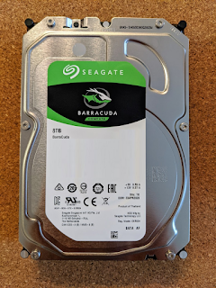
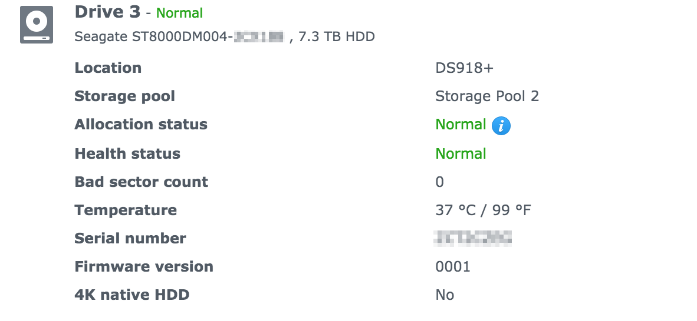
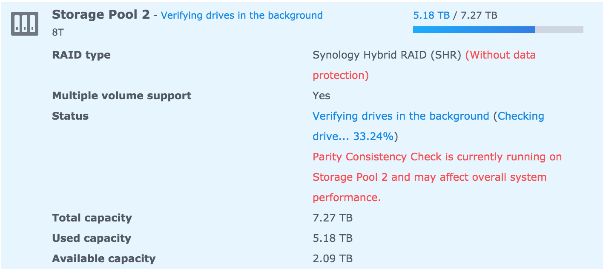

I thought it over and decided not to wait for Black Friday, nor for the storage to run out ahead of schedule. In the spirit of increasing diversity inside my NAS, a green Seagate joined the two existing red WD drives.
<!--more-->

Setup in Synology is very straightforward, practically plug-and-play. You can expand an existing pool, but given that the drive is a desktop model rather than a NAS/server grade one (which gives some hope for increased reliability), I decided to keep it separate and put something there... that doesn't require mirroring across multiple drives.

Sure, all these storage pools and volumes ultimately map to LVM under the hood, but it's so nice not to think about that and avoid all the manual fiddling. Plugged it in, clicked around, it works — hello, old age )))

