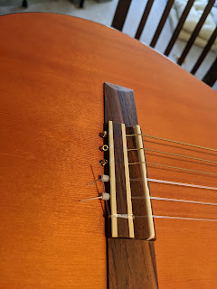
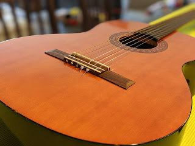
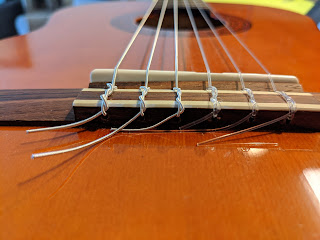
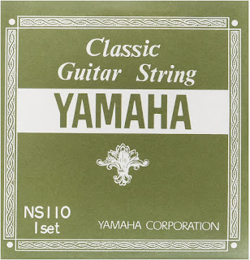

The first time I changed strings with my own hands. The first string (as always) snapped, but at the time the guitar was hanging on the wall and we weren't even home. I suspect the cat may have helped, though there's no evidence.
<!--more-->
## Before

## After

What was on it before — unknown. I put on a Yamaha NS 110 set for $13 and ordered a couple of simpler sets for the future. Of course, all the knots and windings are still settling in; I hope I did everything right and won't have to rewind them.

