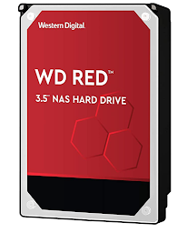
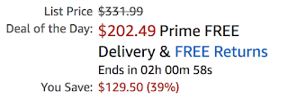
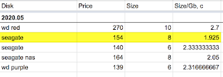
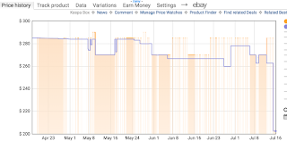

"Come and get it, prices slashed!" — that's basically what an email from Amazon was screaming at me about a grand sale on all sorts of stuff from WD and SanDisk.
<!--more-->

You have only two hours, lucky you, to buy this wonderful 10-terabyte drive at a magical 40% discount! Way back when, I was putting together a starter kit for my NAS and carefully calculating which drives gave the best price-per-GB ratio. I drew my conclusions, but the spreadsheet stuck around and kept growing — not long ago I updated it again while picking another drive for the Synology. That's where I noticed that this very drive had recently been selling for $270, and not the stated $331.99 at all.

Sure, today's price of $202 is pleasant, no doubt. But let's draw the right conclusions about trusting merchants and their marketing hooks with crossed-out numbers.

