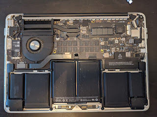
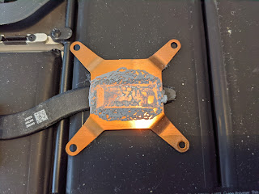
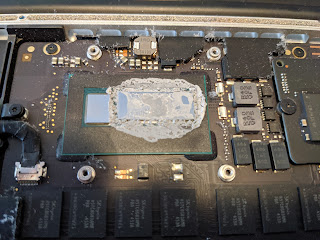
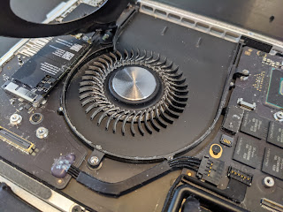

This is what the insides of a six-year-old laptop look like
<!--more-->

I don't know whether it had ever been serviced before or not, but lately it had been running the fan often (though I forgot to check the temperature). You can clearly see that the old thermal paste had already dried out.

Interesting cooler design — like the rear wheel of a BMW: the axle is supported on one side only.

The guy who screwed and unscrewed the 10 screws on the outer cover three times — that was me. First I forgot to stick the sticker from the battery connector back on, and then I had to go back in to actually plug in the battery — I hadn't pressed the connector in fully the first time, so the laptop wasn't detecting it, even though it ran fine on mains power.
Good old KPT-8 thermal compound (shipped all the way from Romania via eBay!) did not disappoint, and now it's quiet, smooth, and blissfully cool. Looking through the photos afterwards, I noticed that the smaller die (GPU?), which doesn't directly touch the copper heatsink, hadn't been covered — though I did smear a little bit there too. Well, something to wipe off next time; for now the flight seems normal.
