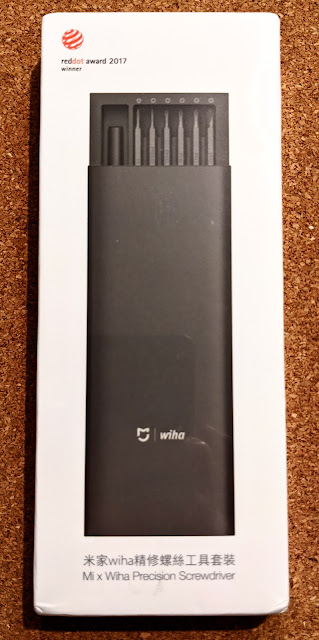
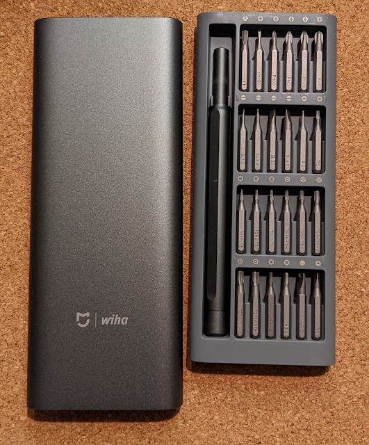
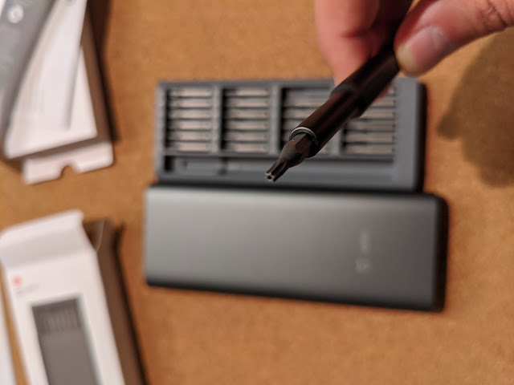
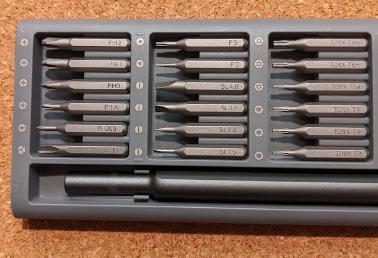
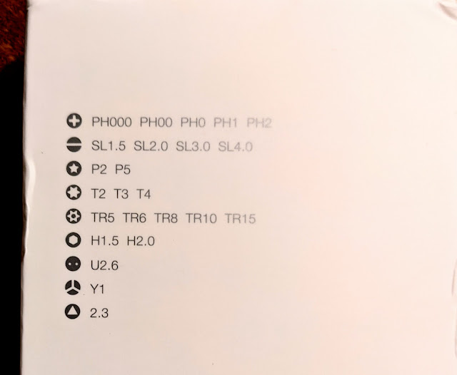

And who just received this adorable little Chinese screwdriver set? That would be me](img00.jpg)

The case is magnetic and holds every bit in place. It's also a metal-and-plastic combo — a metal sleeve slides over the plastic tray.

Finally I have a Torx with a hole! No more having to snap out those miserable pins in screws!

The set is mostly small-to-micro sizes

With a few non-standard bits...

And of course, they arrived after I had already [disassembled and cleaned the laptop](/en/posts/2020/07/30) with the old screwdrivers...
