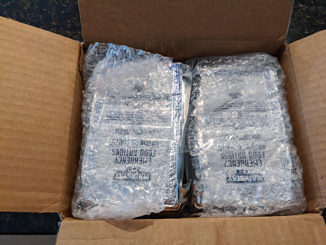
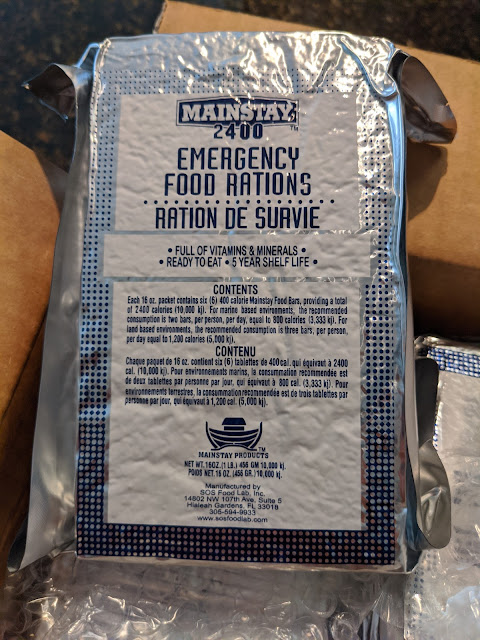
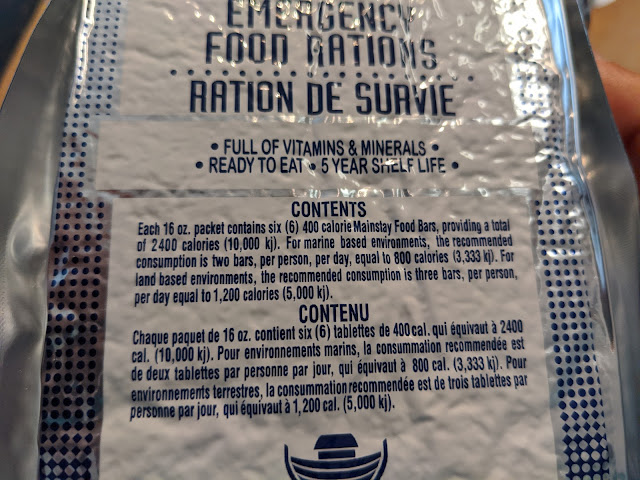
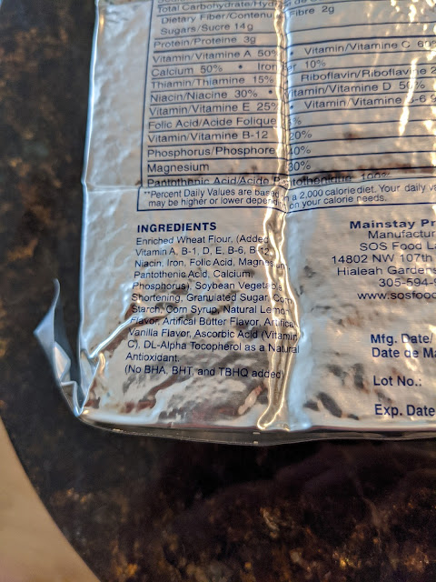
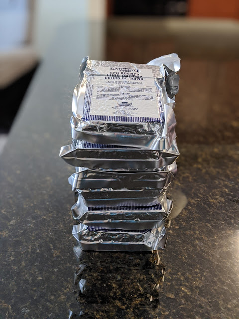

A box of six such packages arrived recently.
<!--more-->

But this is not an HDD, even though it looks very similar in size, design, and weight. It's an emergency food supply — some kind of nutritious bricks that can be stored for up to 5 years. After the recent hurricane, I decided it would be good to have some on hand.
Once the fridge gets a bit emptier and there's no risk of normal food going to waste, I'll definitely test one of those bricks. They say one brick feeds two people for 2–2.5 days. We'll see if it's at least edible at all.

