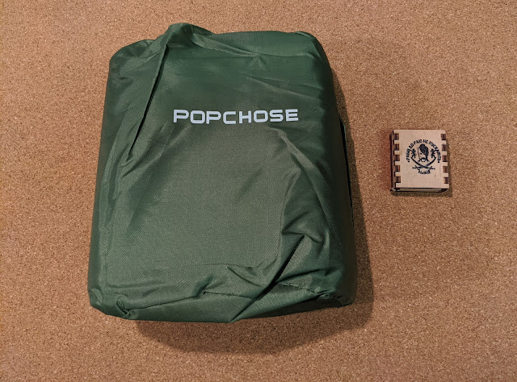
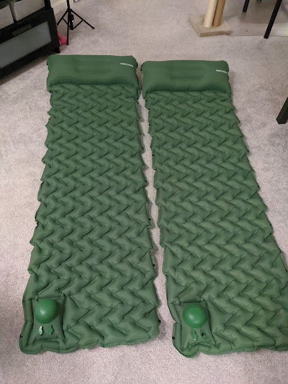

Our first camping experience showed that sleeping on foam pads isn't the most comfortable thing, so our little camper kit has now been joined by these inflatable sleeping pads.
<!--more-->
When packed, they are incomparably more compact; when inflated — incomparably more comfortable, and they even come with a pillow. The pump is built in, they connect to each other, fit perfectly in the tent, and still leave a bit of space above your head for gear.

