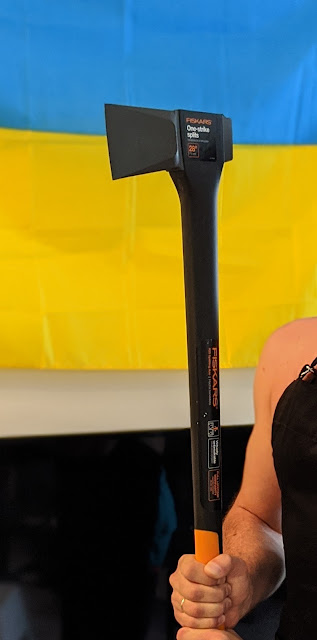
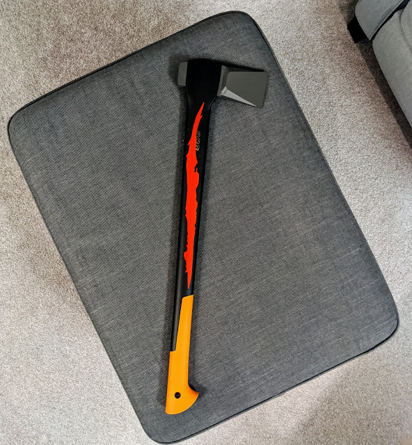

The next addition to the camping arsenal was a hand tool — an axe. After swinging someone else's for a bit, I realized I needed one of my own. And on the advice of friends (not to compensate for anything) — I chose the longer model, the Fiskars X25.
<!--more-->

Add a little tuning, and the axe is fire!

