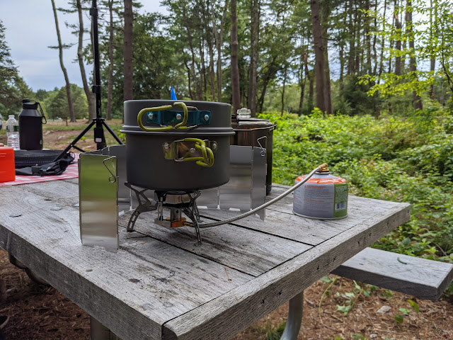
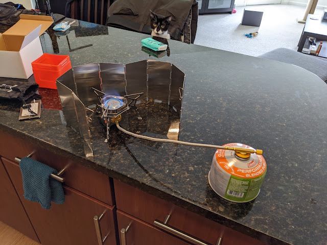

Sometimes there is simply nowhere to make a campfire, or no time for it — or you got your fill of woodsmoke yesterday and now all you want is to boil a kettle.
<!--more-->
The discovery was the existence of these portable compact camp stoves and the gas canisters that go with them. Stoves differ in output — that is, how quickly they will drain a canister and, accordingly, how quickly they will heat a kettle. There are also a few secondary features: whether there is a piezo igniter or not, whether the burner screws directly onto the canister or stands on its own and connects via a hose. Canisters also come in two different types and connector diameters: propane canisters are cheaper, while an isobutane mix costs more but burns down to −20 °C.

Looking at what others use, I chose a more powerful stove with a large burner that stands on the ground — mounting it on top of a canister hurts stability, so lower is better. The stove is designed for the expensive compact canisters, but with an adapter it can be connected to the cheaper ones. That said, even the mini canister in the photo lasted for two trips and around five full kettles. One advantage of a compact canister: it fits perfectly inside a cookware set, slipping right into the smallest pot as if it belongs there. And the windscreen — a little fence of silver metal panels — is a useful thing: it keeps the heat from being wasted, and in a strong wind it stops the flame from going out altogether.

