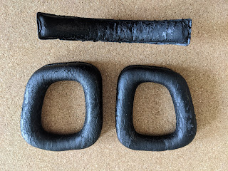
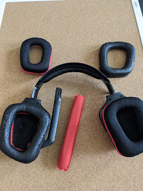
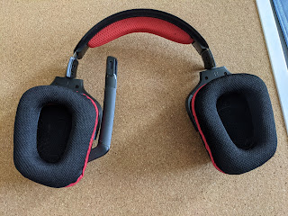

My Logitech G930 headphones are not without their issues — the battery has weakened, the sound drops out occasionally, and there's no alternative connection method besides their own USB dongle — yet they remain the only ones that connected to the PlayStation (for some reason Sony's console refused to see my Sony headphones over Bluetooth). And unlike those Sony ones, the G930s play music and voice calls equally well — because the Sonys switch to headset mode during calls and the background music sounds like it's coming through a phone.

<!--more-->

In short, the headphones are great — comfortable, good-sounding, and I bought them ages ago at a laughably low half-price. So when the faux leather ear pads finally started falling apart, crumbling into little black flakes of pseudo-leather around me — I couldn't bring myself to throw them away and decided to replace the pads instead. To my surprise, the official Logitech website no longer supports these headphones, even though it hasn't even been 10 years. But there's AliExpress, so for about five and a half bucks I found excellent fabric replacements for the time-worn material.

No tools needed whatsoever — take off the old ones, put on and push in the new ones, give them a vacuum, voilà!

