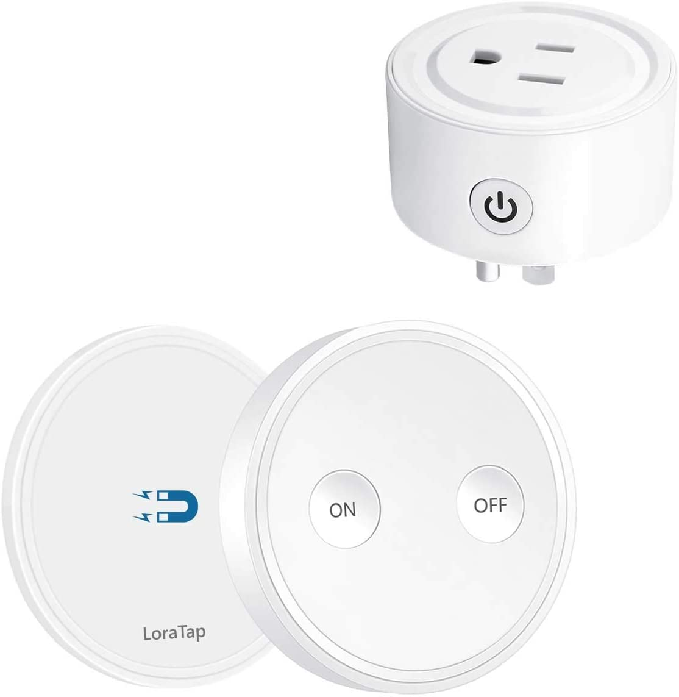

This story begins in a neighbor's bathroom.
<!--more-->
While visiting friends in our same apartment complex, I noticed how much quieter their exhaust fan was. Ours has growled like an old dog from the very start — clearly worn out mechanically and rattling non-stop. In our previous place the fan had its own switch, so when you wanted to lie in the bath in peace, you could leave it off and air things out afterward once you were done. Here there's a single toggle that turns on both the light and that raspy monster at the same time, so you either lie in the dark or endure the constant noise.

But this is America. So all problems in rental housing are solved by the landlord. I submitted a request through my online tenant portal and a guy from maintenance came by. An older fellow showed up with a stepladder, unscrewed the fan cover, removed two more screws, and pulled the fan out, unplugging its stubby cable from the outlet hidden behind the grille. He took it somewhere to clean off the dust and brought it back. Plugged it in, screwed it in — rattles exactly the same. With a "that's how it's supposed to be," he wasn't interested in my objection that the identical fan in the neighboring unit whispers along silently, and he left. While I was thinking about what words to use in an angry message to the office demanding the fan be replaced — I just unscrewed the grille myself and switched the damn thing off. Finally taking a bath in that long-awaited silence, I decided to leave it that way for a while — after all, we lived without bathroom fans before and it was fine.

Because this is America — and "good enough" is widely practiced here, the local equivalent of the Soviet "it'll do." The fan works. Sir, we understand your concern, but there's nothing we can do. It's a little noisy. That's how it's supposed to be. (Internally — it's not my place it's noisy in.) Good enough. Have a great day, sir.

And I'm a sociopath and an engineer — and I'll prefer a technical solution over a social one. Seeing that the fan plugs into a standard American outlet rather than being hardwired or connected through some clever connector, I decided to add a switch for the fan myself.

These days Amazon is full of smart outlets — with scheduling, Wi-Fi control, smartphone apps, and internet connectivity — but what I needed was something less smart, a dumb outlet, just enough to pair with a remote on/off button and nothing else. Fortunately those exist too, though priced at the level of mid-range smart plugs (and cheaper than the cheap smart ones).

So $20 — and [this little gadget](https://www.amazon.com/gp/product/B07GNJ36CG/ref=ppx_yo_dt_b_search_asin_title?ie=UTF8&psc=1) arrived at my door.

The outlet part didn't fit straight up into the socket — it's wide and has three prongs (ground), while the one I needed to plug it into has no ground — so I also had to order a short narrow male-to-female extension from AliExpress (and trim it a little so the ground tab wouldn't get in the way). Fortunately there's plenty of space between the grille and the fan and everything fit.

The remote is stuck above the wall light switch (well, not the remote itself, but the magnetic pad it snaps onto), and now I can finally turn that buzzing thing on separately and switch it off when needed. The outlet does have a tiny bit of smarts — it remembers its state, so if it was turned off, it stays off.

Hallelujah, things are finally the way I need them. Now just don't forget to take the dumb outlet with me when we move out.
