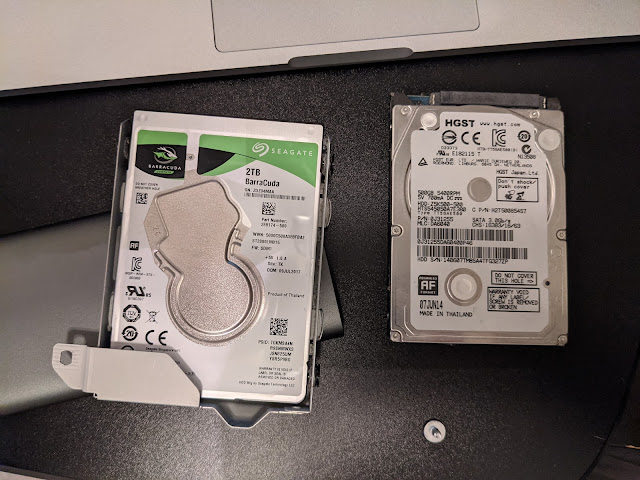

Well, what can I say. Finally. It happened. Giving in to this year's madness triggered by the release of yet another new PlayStation, I decided to upgrade mine as well.
<!--more-->
Damn, games take up some insane amount of gigabytes, so the 500 GB drive had long stopped being enough for the toys I have — even though there aren't that many of them. So I finally worked up the courage and dug out from storage a two-terabyte drive pulled from Kodi/Nuke, backed up the console (thank goodness I thought of that, and a 128 GB flash drive just happened to buy itself at the right time...)

Inside turned out to be some no-name HGST — should be the original one that ships with the console. Either way, this guy is already too small for anything. Maybe it'll go back into Nuke someday if I ever get around to it, but for now — drive on the shelf, and time to re-download hundreds of gigabytes!
