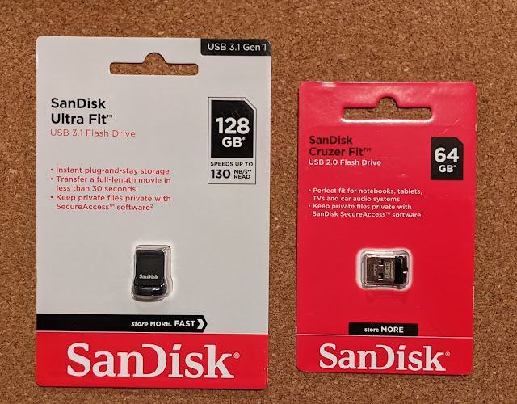

Somehow before I knew it, I'd picked up a couple of flash drives. Time moves on, and the enormous university flash drive with its 4 GB is now only good for booting Ubuntu onto one of the old machines. And if you want to put a bit of music in the car — you'll need to upgrade. Well, let the bigger one just sit there. You never know when you might suddenly need a 128 GB flash drive in the middle of the night...
<!--more-->

