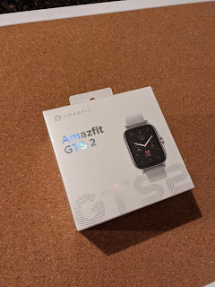
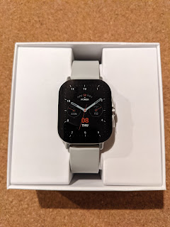
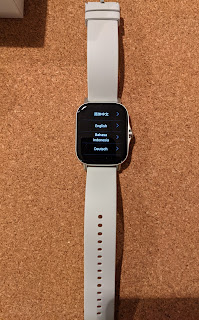

For quite a long time I was perfectly happy with my Pebble Steel. Even after the company was acquired and shut down by competitors, enthusiasts had written the software, a server with watch faces, and everything kept ticking along. The watch looks great — metal bracelet, a familiar almost-LCD screen, and a battery that lasts a couple of weeks. Modern watches that need daily charging can't even compare!
<!--more-->
But first the vibration motor broke (well, technically just its little wire came loose), and with my dad's help it was soldered back twice — though neither repair lasted long. The wire kept coming off because you had to go inside the case to deal with the buttons, which would stop working and needed cleaning to come back to life — and every time, the wire would tear away again, since the vibration motor is glued to the back cover.

Little by little the buttons stopped responding even after cleaning, and I wore the watch like that for quite a while longer (and would have kept going), until one trip when I forgot the charging cable, the battery died, and the watch turned off. Turning it back on worked — but setting the time didn't. The buttons wouldn't respond and showed no intention of doing so, and time sync with the phone had been disabled long ago as pointless — since the watch didn't buzz anyway, there was no reason to waste Bluetooth heating up the air...

That's how I ripened into buying a new watch (or maybe several — shopping is the kind of thing where it's hard to stop), and after going through the options I settled on the Chinese [Amazfit GTS 2](https://us.amazfit.com/pages/amazfit-gts2). Compared to the first version, the main difference is the organically hidden crown. It's also metal, water-resistant to 50 meters, and lasts up to two weeks on a single charge depending on which features are enabled — obviously with a continuous heart rate monitor, oximeter, GPS, and Wi-Fi running it won't last that long.

But the feature set is significantly richer than the Pebble — starting with the basic step counter (the Pebble technically had one, but it didn't really work), all the way to functioning as a Bluetooth headset or, for example, playing music directly from the watch. Now I can listen to a podcast in the bathroom straight from my wrist...

We'll see how it goes, what sticks and what doesn't. A metal bracelet is still somewhere en route from AliExpress.

