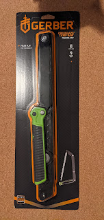
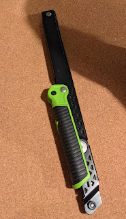
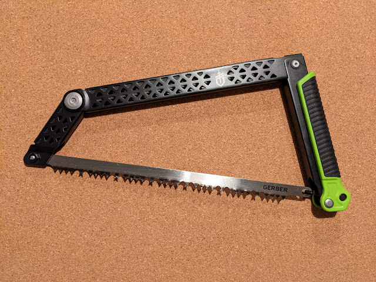

This particular purchase, on the other hand, was well thought out — it had been patiently sitting in my Amazon wishlist, waiting for a discount.

After swinging an axe all summer and realizing that cutting trees crosswise is not the most rewarding of tasks, I decided to splurge on a saw. Naturally, for camping I wanted something portable and foldable — though you could just as well throw a regular hand saw in the car, it wouldn't be quite feng shui.

I never did get that Amazon discount, but found it a full $5 cheaper at Home Depot. I keep reinforcing my conviction that good things don't sell for a third of their price, even though habit and my inner Gascon occasionally demand cheapness and freebies.

One way or another, the saw was bought, arrived — and went straight onto the shelf to wait its turn come spring.

