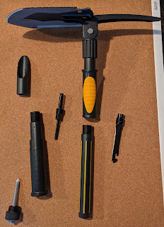
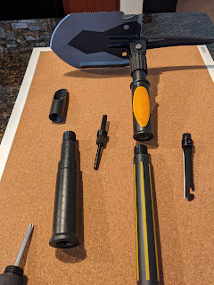
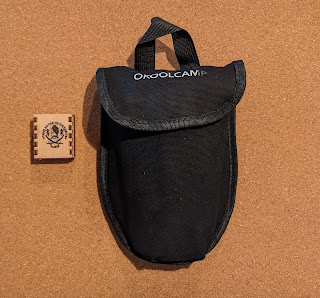

The absence of snow in these parts had made me a bit complacent — but that won't do, so a shovel was finally bought and put in the trunk.
<!--more-->

This time, instead of Fiskars, I went with a marvel of Chinese industry: three sections joined by threading — takes a little while to assemble, but from a very compact bag you can put together a tool that's more than half a meter long. And what a tool!

In addition to the shovel itself, our generous Chinese friends throw in:

- a glass breaker
- a screwdriver — flathead and Phillips
- a fire striker
- a whistle
- a harpoon
- a saw
- a small knife
- a nail puller
- an alpenstock (or whatever you'd call the pointy end opposite the blade)

The shovel itself also has extra functionality — one edge is sharpened, the other is a saw, there are two holes for bolts, and of course — a bottle opener for beer! Oh, and the blade can be locked flat like a shovel, or at a right angle, like a hoe.

Of course, this is nowhere near the thoughtful modularity of the ["Viy"](https://dobryi.in.ua/lopatka-sokira-viy-green-apples/) solution by [Serhiy Vovkulaka](https://dobryi.in.ua/avtonabir/), but in the absence of that domestic masterpiece — you make do with what you've got.

Now I'm waiting for a chance to try it out on a camping trip!

