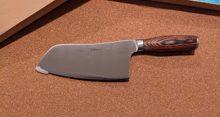
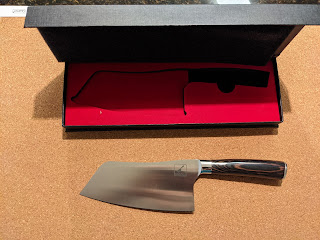
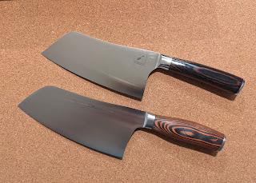

Inspired by gourmet ideas, nurturing the notion of culinary caste greatness... or, more honestly, after scrolling through Instagram of Poles living in Ireland, I bought myself a little knife to cook outdoors.
<!--more-->

The choice between two came down in favor of the first one — simply because of the price, as the difference is twofold. No need for two at the moment; for starters I'll learn to work with what I have, and we'll see from there.

Now I just need to figure out what and how to sharpen it with....

UPD: Adding Amazon links:

- First knife [Mueller 7-inch Cleaver Knife, Vegetable Meat Chinese Chef's Knife, German Stainless Steel with Ergonomic Pakkawood Handle, for Home Kitchen and Restaurant by Commerce Planet Learn more:](https://www.amazon.com/dp/B08BX7136Z/ref=cm_sw_em_r_mt_dp_QJC62R5JA1AM4TT900Q7?_encoding=UTF8&psc=1) (brown handle, cheaper)
- [Second knife](https://www.amazon.com/dp/B08KD27THM/ref=cm_sw_em_r_mt_dp_7D7VZHEM5XJ8WZ7G56QN?_encoding=UTF8&psc=1) (darker handle, more expensive)
