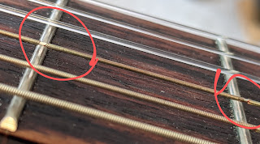
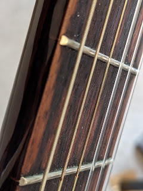

Less than a year has passed (July to February: about 8 months) since [replacing the strings](/en/posts/2020/07/11) from "whatever was on there" to Yamaha NS 110. After half a year of light strumming, the brand-new strings already look like this:
<!--more-->

The winding on the fourth string has worn through in at least two spots, and the winding on the fifth is noticeably chewed up opposite a couple of frets.
I don't think replacing just one string is a good idea, so when I find the time and motivation — I'll perform a second transplant operation with a fresh set.
