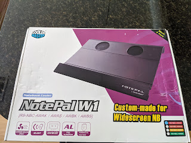
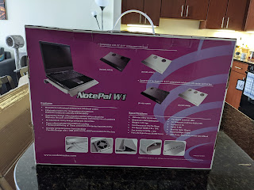
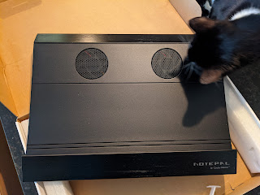

The "Canada Days" trend was born in my [booze blog](https://t.me/gramm330), and I kept trying to remember what else Canadian from the past month (besides the beer and whisky) I had forgotten — and here it is.
<!--more-->

My laptop started running hot, so I (again) replaced the thermal paste (and might replace it once more — swapping the KPT-8 delivered from Latvia for something more modern) — and began thinking about a cooling pad. Looking on Amazon, I was pretty disappointed and found myself longing for my old **Notepal** from Cooler Master — it was a solid chunk of metal (aluminium?), with two fans and a nice little ridge at the bottom for the wrists, making for a more comfortable hand position and easier typing. Unfortunately, I couldn't find it anywhere (it's been discontinued for ages). I picked something at random (from the popular ones) for ~$20; what arrived was a flimsy plastic grille that flexed under any pressure, the fan was noisy, and it could only be switched off by physically unplugging the USB. I sent it back, and was starting to mentally prepare myself for some premium stand in the $50–$80 range — when a nostalgic image search led me to a Canadian shop's website where that very Notepal was listed for 11 CAD! [The site looks](https://www.allwaytech.com/catalog/index.php?main_page=product_info&cPath=168&products_id=329&zenid=u1fvtrd0qf0gcu2933nl1d8221) like a greeting from the '90s, the shipping cost was twice the price of the item itself, but the longing for that familiar old stand (which I apparently sold for ₴100 when moving away) clouded my judgement and I placed the order.

Contrary to expectations, the site and shop turned out to be fully operational — the order was accepted and the money was charged. My hopes were pessimistic: starting from the suspicion that this was a dead ghost-site frozen somewhere in the distant past, I moved on to thinking there simply wasn't any stock, even if it claimed otherwise. But a couple of days later they sent an email with a tracking number, and a few days after that the parcel arrived. In fact, that parcel marks the end of those very "Canada Days" — the stand arrived, I'm happy, I'd love to write that the laptop is running cool now, but no, it still runs hot; yet I'm so pleasantly riding the post-catharsis wave of a successful "adventure" that I don't really care %-)

UPD: went back to the site to add the link to this post — and saw that after my purchase they raised the price to $28! Looks like the return on this investment beat Bitcoin, \+200% in a couple of weeks ))

