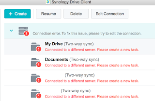

Not even a year and a half had passed since I became a happy owner of a [home server](/en/posts/2019/12/04) from Synology, and it already went belly up.
<!--more-->
I'll start with a spoiler — it's not a total disaster, and the data is intact. The server itself, though, not so much.

## The mysterious beep

The symptoms started with irregular single beeps from the speaker, roughly once every few dozen minutes — I even initially thought it wasn't coming from my machine. After a few such beeps, the server chirped differently and went into a reboot. It blinked its blue power button light for a long time, then came back up — but instead of the management web console, it showed me the web console for initial device setup.

At first I was pretty scared: I powered it off, took it apart, cleaned out the dust, and googled. I found that due to a physical defect in the hard-reset button (the kind recessed into the case, pressed with an unfolded paperclip, common in many routers — it erases the device's internal firmware), the button was triggering on its own and wiping the server. The data was supposedly intact. But some users reported an endless reset loop — every five minutes.

## Recovery

I grumbled, reassembled the cleaned-up server, went through initialization — and got a bare box with almost nothing, just the file shares. No Plex, no Gitlab server on Docker, no Synology Drive — nothing. No users, no settings either. Fortunately, I found a fairly old config backup, restored it — the users came back. I reinstalled Plex and Drive — Plex immediately found its entire previous movie library, and Drive found all the folders. The laptop re-synced its folders — everything worked.

However, while I was still counting the new grey hairs — the server beeped again, and again, and rebooted again. Same result: the internal "OS" wiped. Automating this whole affair is rather limited, so again — 10 minutes of setup through the web, then manual restoration of settings and packages — it works.

## Replacement

It kept working like that for a couple of days, then after another reboot I gave up and installed only Plex (after all, all important documents exist in several other places, so media takes up the most space on the server anyway), and after yet another reset — I shut it down. By that point I had already written to the manufacturer's support, as recommended online — and they offered a free replacement. If I send them the defective unit first and they send me a working one after — it's completely free; if it's the other way around (they ship the new one first, I return the defective one) — I'd need a credit card, which they charge the module's price to and refund upon receiving the defective unit.

So, I'm waiting for the replacement to arrive, I'll move the drives over and hope it goes better than last time. To say I'm disappointed would be an understatement. I've had a home NAS/multimedia setup in one form or another for over 10 years. Before this I used nettops (ZOTAC ZBOX and Intel NUC) with a regular laptop hard drive inside and plain Ubuntu — and had no problems. Now I've had three drives with a combined 12 terabytes of capacity sitting silently for a week — and I can't use them, because, goddammit, some micro-button somewhere is wiping something!

Free warranty replacement is something at least, but there's the downtime, the lost nerves, and I'll still have to spend $10–20 on return shipping...

Good thing the drives with the data are intact. Seems like it's finally time to set up a backup to `AWS Glacier`, and while I'm at it — think about a backup NAS as well....

## Update 2024

What and how I ended up backing up (and whether there's a backup NAS) can be read on a separate page for the [backup project](/en/docs/projects/backup/).
