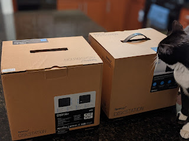
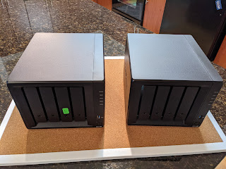
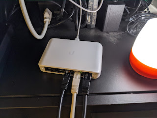
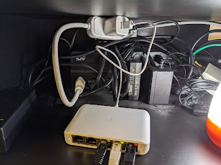

The replacement Synology arrived. I swapped the drives over, and while I was at it, threw in 4 GB of RAM that had been sitting in a drawer anyway — now it's at 8. Plex came up quickly, I restored the config too, fine-tuning will happen as I go.
<!--more-->

Since I was already digging around in the cabinet where all the cables are stashed, I decided to finally put the gigabit Ubiquiti switch to use — it's been sitting around for a few months now. I bought that particular one because it has PoE IN, and my router has PoE OUT, with all the UPS outlets already taken. However, for reasons unknown to me, the switch refused to power on via PoE, even though the router dutifully reports in its interface that a recipient device has been found and power has been enabled. Found a short extension cord and a two-port USB charger in the drawer — now the TV and the switch are both running off a single UPS outlet. Well, now my sad two devices that actually have gigabit will be able to ping each other faster.

