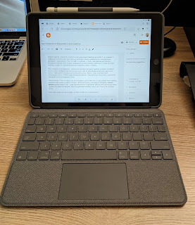

A short note — while Apple is dragging its feet releasing the new MacBook Pros with M1X, I'm suffering with an old 2013 laptop that is struggling badly with today's demands. A video call in Teams or Skype, and especially in Zoom with a virtual background overlay, slowly melts it, despite the thermal paste having been replaced twice (and I might do it a third time, who knows). Even ordinary browsing lags, stutters, and glitches.
<!--more-->

So I went experimenting — trying to do all non-work activities on the iPad. Hand on heart, and making an exception for hobbies like programming (which I don't have time for anyway) — besides work, I don't need all that much from a computer: a window to the internet, YouTube, messengers, email. And 90% of my needs are covered by a browser — from email to paying bills/credit cards/etc.

Why on an iPad? Because before I gifted one to my dear mother-in-law, I really appreciated the quality of the device I'd picked up on a Black Friday deal. The gorgeous screen, the long-lasting battery, the joyful synergy of Apple's ecosystem — all of it stands out sharply from the Android tablets I've owned, which in my hands did nothing but beg to be charged. The iPad, on the other hand, ran for weeks, even though back then I was only watching YouTube over lunch.

This time I got a basic one again — not the Air or the Pro — but with a keyboard (and the stylus was left over from the previous one), and for two weeks running now I've been confirming that this idea works. I got a silent, tiny computer with a touchscreen that can serve as a tablet, running basically the same hotkeys/gestures as the big machine, and handling the vast majority of everyday tasks.

Reading a book, listening to a podcast, controlling speakers, checking work email and Teams, reading personal and work Skype/Slack (and writing back when needed), paying bills, zoning out on YouTube or Facebook, taking something on Coursera, edX, or Udemy, having a video call with friends — so far so good. Oh, and one charge of this computer lasts several days…

What it probably can't do is connect external devices like a hard drive. But fortunately, Synology has an iOS client — so I get my files straight over the air. Eventually I'll also try setting up an SSH client, and then I'll be able to do something with servers too.

So far in two weeks, I've found only one annoying difference — the browsers here don't have proxy settings; that's a system-level setting. So routing one browser through a proxy and another directly didn't work out. On top of that, there's no SOCKS proxy setting at all, although I did find a hack via Google for how to do it. But it's not a critical need for now — I only needed it once every couple of weeks anyway, so I can reach for the laptop when that comes up.

Well, experimenting continues.

