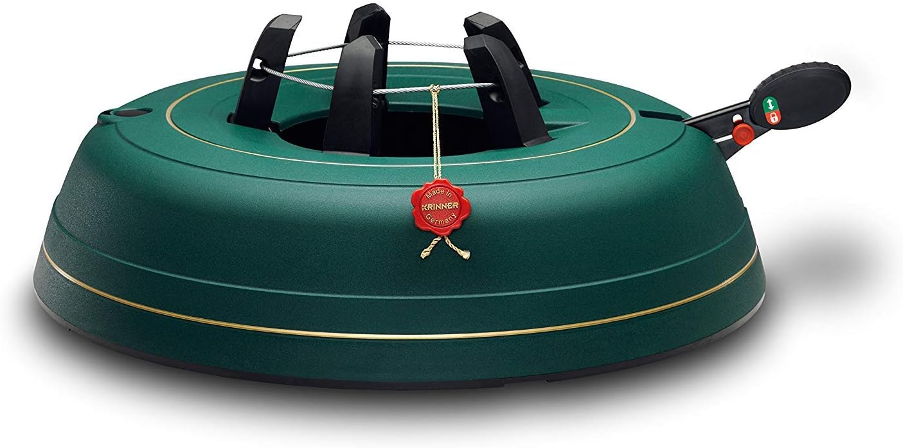
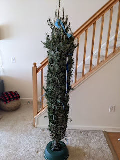

I'm the kind of person who buys a Christmas tree stand at the end of February.
<!--more-->

Because after a decent struggle assembling the previous one, I threw it out together with the tree. I did some market research and found that there are much better options out there — like this awesome thing with a foot pedal that secures the trunk simply and reliably.
At that near-Christmas time, though, it cost **~$80**, which seemed like too much even for a very good stand. So I signed up for price tracking — and when a notification came in that there was a used one for twenty bucks, I bought it without hesitation. After all, a $60 discount is worth tolerating a torn box and a few leftover needles from last year.

This thing — and this post along with it — had been sitting around since summer, waiting for their moment. What can I say: it's the most convenient Christmas tree holder you can imagine. The tree goes in, a few kicks of the foot — voilà, done. Turns out you can pinch the rope by accident and it's no big deal: two minutes to unmount, trim the rope, and remount the tree.
Brought it inside — the tree was visibly crooked. Again: 10 seconds, dismount, mount — done.
German engineering, God bless it with health and profits.

