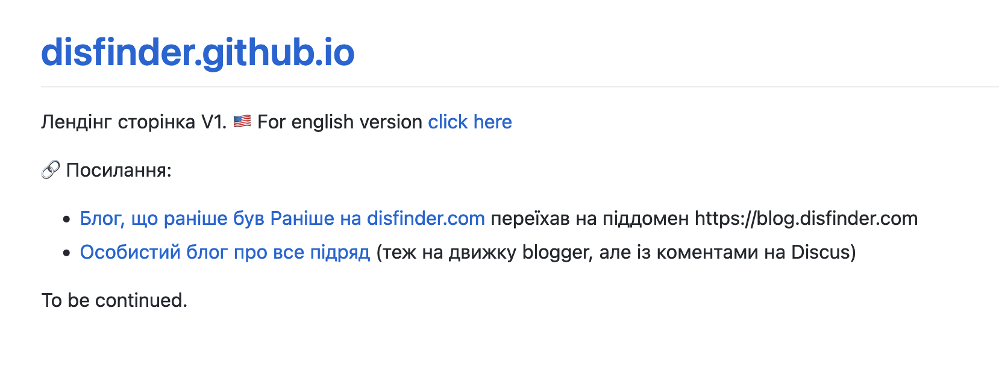

## Preamble

For some reason, I felt like rebuilding my website by the end of 2023 — if before it just hosted the content of my blog (one of them), I wanted to turn it into a "typical" placeholder: a small static page (or a set of pages) with a collection of useful links to blogs, articles, maybe a GitHub or LinkedIn profile, and so on.
What's the best way to host something like that? GitHub Pages, of course — you write some markdown, push it to a repository, GitHub does its magic — and voilà, the site is ready.
Minimum effort, maximum result, especially since https://disfinder.github.io had already existed for some time, hosting various notes I made for myself.
<!--more-->
## Landing V1

Said and done!
Having nuked (with a prior backup) whatever was on GitHub Pages, and fiddling a bit in the hosting panel with DNS settings — it turned out to be not that hard to point my domain to a GitHub page. Looks pretty bare-bones, but it'll do for a start.



## Okay, but let's bring the articles back

Quite a while ago I came to the conclusion that a blog and its posts work well for announcements about some event, about something that happened at a specific point in time:

- "Oh boy, [look, I'm moving again — from tumblr to blogger!](blog.disfinder.com/2012/09/blog-post_1875.html)
- [Oops, my server crashed...](https://p.disfinder.com/2021/02/blog-post_22.html)
- [Today I thought that writing articles is better done in git, not in a blog](https://p.disfinder.com/2021/12/blog-post.html)

But for some meaningful chunk of information — like that example with the [list of books and articles I strongly recommend reading](/en/docs/articles/must-read/) — it's not very convenient to have it as a blog post dated back to some shaggy [2012-06-4], share links to it, and update/expand the post over time.

## Okay, GitHub Pages seems made for articles

Let's figure this out.
Under the hood, GitHub Pages runs something called [Jekyll](https://jekyllrb.com/) — which they describe as:
> Simple Static Blog-aware

Okay, GitHub... ["Here's how to add a theme to your site using Jekyll"](https://docs.github.com/en/pages/setting-up-a-github-pages-site-with-jekyll/adding-a-theme-to-your-github-pages-site-using-jekyll)

>If you want to preview your changes first, you can make the changes locally instead of on GitHub. Then, test your site locally.

Fine, let's read [Testing your GitHub Pages site locally with Jekyll](https://docs.github.com/en/pages/setting-up-a-github-pages-site-with-jekyll/testing-your-github-pages-site-locally-with-jekyll)

> Before you can use Jekyll to test a site, you must:
>> Install Jekyll.
    Create a Jekyll site. For more information, see "Creating a GitHub Pages site with Jekyll."
>> We recommend using Bundler to install and run Jekyll. Bundler manages Ruby gem dependencies, reduces Jekyll build errors, and prevents environment-related bugs. To install Bundler:
>> Install Ruby. For more information, see "Installing Ruby" in the Ruby documentation.
    Install Bundler. For more information, see "Bundler."

So, to write a blog post, I need to:

- install Ruby
- install some Bundler
- install Jekyll via that Bundler

Seems like a lot, I told myself, but I should at least try. Even though I really don't want to deal with Ruby.

## ...but the hedgehog can never be buggered at all

```shell
$ gem install bundler
ERROR:  While executing gem ... (Gem::FilePermissionError)
    You don't have write permissions for the /Library/Ruby/Gems/2.6.0 directory.
```

But I do have Bundler — no idea where it came from, maybe it's the system one.
Okay, what's next in the quest?

```shell
$ bundle init
$ bundle config set --local path 'vendor/bundle'
$ bundle add jekyll # damn, ignores the previously set local path setting, Ctrl-C
$ bundle install --path vendor/bundle
$ bundle exec jekyll new --force --skip-bundle .
bundler: failed to load command: jekyll (/Users/disfinder/tmp/jekyll/vendor/bundle/ruby/2.6.0/bin/jekyll)
LoadError: cannot load such file -- google/protobuf_c
```

wump-wump-wump...
End of the line.
But I didn't give up immediately — only after Googling for another couple of hours and getting elbow-deep in all that Ruby stuff did I finally decide that at least when it comes to my own choices, I don't have to support this crap and I'd better pick something else.
And went to bed.

## Alternatives

Since the ugly site kept nagging and itching, I had to continue the search to close this gestalt — I need to restore my priceless articles, and I also need to write a new one [for Tivasyk about Syncthing](https://blog.tivasyk.info/blog/2023/12/10/docker-migration.html#comment-6351525823).

A quick Google search turned up several candidates:

- [hugo](https://gohugo.io/)
- [gitbook]
- [Eleventy]
- "[Gatsby] is great but you need to know React" — thanks, but no
- even [codeberg](https://tonisagrista.com/blog/2022/codeberg-setup/) was recommended

Well, let's start with Hugo...

## First Experience

```ruby
    brew install hugo
```

And that's it, everything works, no dependency/gem headaches or other mysterious coprolites...
That's Go magic in action!
What's next?

```shell
$ hugo new site .
$ hugo new site . --force
$ hugo new content docs/home.md
$ hugo server --buildDrafts
    Built in 31 ms
    Environment: "development"
    Serving pages from memory
    Running in Fast Render Mode. For full rebuilds on change: hugo server --disableFastRender
    Web Server is available at http://localhost:1313/ (bind address 127.0.0.1)
    Press Ctrl+C to stop
```

Wow, magic — opened the browser and everything works!
Time to read the docs!

## Migrating GitHub Pages to Hugo

Okay, to teach GitHub to use Hugo instead of that Dr. Jekyll — Hugo even has [documentation](https://gohugo.io/hosting-and-deployment/hosting-on-github/) for that, and I've already done the first few steps.
All that's needed is to switch the repository build to GitHub Actions in the Pages section of the settings, and commit a workflow file — trivial stuff, thankfully I'd gotten a bit familiar with Actions at some point.

### Choosing and installing a theme

I liked this [book theme](https://themes.gohugo.io/themes/hugo-book/), but being a true paranoid — I decided it was worth [cloning it](https://github.com/disfinder/hugo-book)

```bash
git submodule add https://github.com/disfinder/hugo-book themes/hugo-book
```

### I18N

Let's make the site multilingual right away for our English-speaking friends. So what if the English version will be empty? I'll put a resume there someday.
At least all the links will be correct from the start, and I won't have to fight with broken links later.

## Outro
What's left?
Add a Disqus identifier and post all of this.
If you're reading this article — it means I succeeded.
Hallelujah.
